# 12. 서비스 메시 (Istio 중심)

> 본 실습은 **Master 1 + Worker 2 (총 3노드) 클러스터** 를 기준으로 합니다. PDF 가 강조한 "사실상 표준(De facto)" 인 **Istio** 를 직접 설치하여 사이드카, 트래픽 관리, mTLS, 관찰성을 모두 시연합니다. **Linkerd / Consul** 은 Istio 와 동시에 사용할 수 없으므로 **개념과 YAML 골격만** 학습합니다.
>
> 모든 `kubectl` / `istioctl` 명령은 **Master 노드**에서 실행합니다.

> ⚠️ **리소스 주의**: Istio 컨트롤 플레인 + bookinfo 샘플 + 관찰성 addons 까지 띄우면 노드당 약 0.5~1GB 메모리가 추가 사용됩니다. 노드 메모리가 빠듯하면 Step 11 의 addons 일부(예: Grafana, Jaeger)는 생략해도 핵심 학습은 가능합니다.

---

## Step 0. 작업 폴더 + 클러스터 점검

```bash
mkdir -p ~/k8s-week12
cd ~/k8s-week12

kubectl get nodes
kubectl get pods -n calico-system        # CNI 정상 동작 확인
```
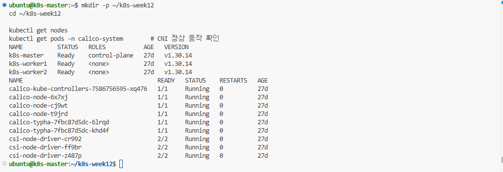

---

## Step 1. Istio 설치 (PDF 17쪽)

### 1. istioctl 다운로드

```bash
curl -L https://istio.io/downloadIstio | ISTIO_VERSION=1.23.2 sh -
cd istio-1.23.2
export PATH=$PWD/bin:$PATH

istioctl version --remote=false
```
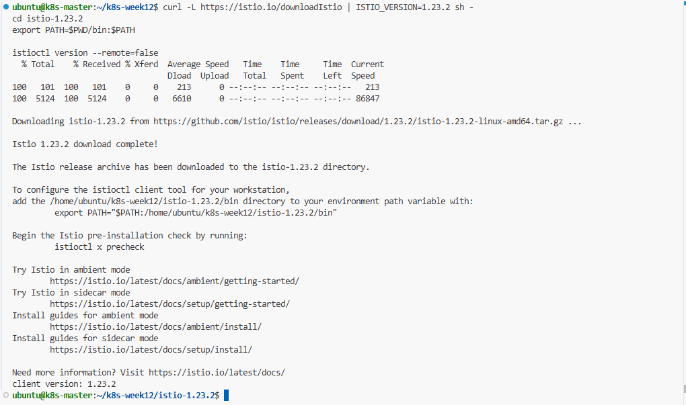

### 2. demo 프로파일로 설치 (학습용 — 모든 컴포넌트 포함)

```bash
istioctl install --set profile=demo -y

# 컨트롤 플레인(Istiod) Ready 확인
kubectl -n istio-system get pods
kubectl -n istio-system rollout status deploy/istiod --timeout=180s
```
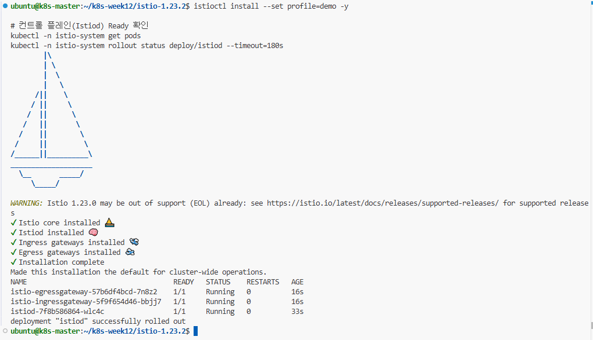

> demo 프로파일은 학습용으로 IngressGateway·EgressGateway·기본 정책을 모두 포함합니다. 운영 환경에선 `default` 또는 커스텀 프로파일을 권장합니다.

### 3. CRD / IngressGateway 서비스 확인

```bash
kubectl get crd | grep istio.io | head -10
kubectl -n istio-system get svc istio-ingressgateway
# 학생 환경에서 EXTERNAL-IP 는 <pending> 으로 남음 (Week 10 의 LoadBalancer 한계 — 정상)

# 이후 단계 위해 작업 디렉터리로 복귀
cd ~/k8s-week12
```
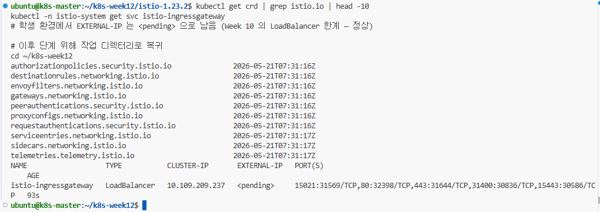

---

## Step 2. 네임스페이스 사이드카 자동 주입 + bookinfo 배포 (PDF 7쪽)

### 1. 네임스페이스에 사이드카 자동 주입 라벨 부여

```bash
kubectl create namespace bookinfo
kubectl label namespace bookinfo istio-injection=enabled
kubectl get ns bookinfo --show-labels
```
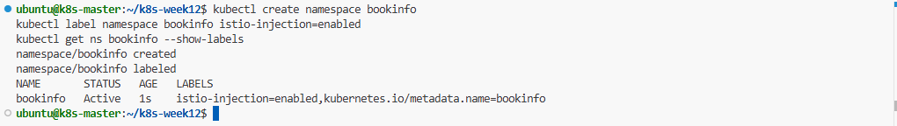

### 2. bookinfo 샘플 앱 배포 — Istio 공식 데모 (productpage/details/ratings/reviews v1·v2·v3)

```bash
# istioctl 디렉터리에서 다운받은 샘플 사용
kubectl apply -n bookinfo -f ~/k8s-week12/istio-1.23.2/samples/bookinfo/platform/kube/bookinfo.yaml

kubectl -n bookinfo rollout status deploy/productpage-v1 --timeout=180s
kubectl -n bookinfo get pods
```
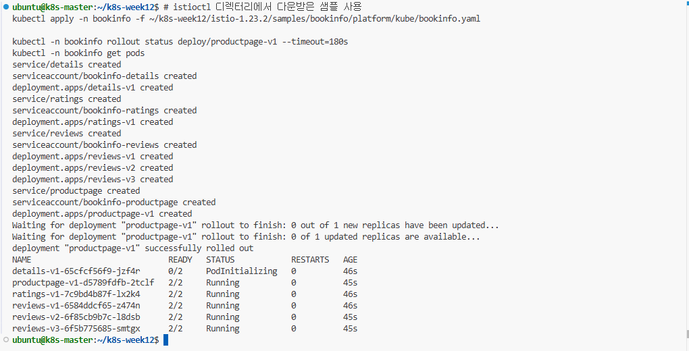

### 3. 파드별 컨테이너 개수 확인 — **모든 파드가 2/2 (앱 + Envoy 사이드카)**

```bash
kubectl -n bookinfo get pods -o wide
# READY 컬럼이 2/2 인 게 핵심 — 사이드카(Envoy)가 자동 주입된 결과

# 사이드카 컨테이너 이름 확인
kubectl -n bookinfo get pod $(kubectl -n bookinfo get pod -l app=productpage -o jsonpath='{.items[0].metadata.name}') \
  -o jsonpath='{.spec.containers[*].name}{"\n"}'
# 출력: productpage istio-proxy
```
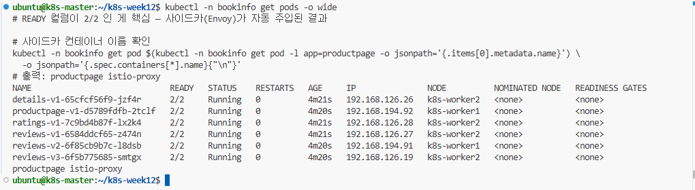

---

## Step 3. Gateway + VirtualService 로 외부 노출 (PDF 17~18쪽)

### 1. bookinfo 의 Gateway / VirtualService 적용 — 공식 샘플

```bash
kubectl apply -n bookinfo -f ~/k8s-week12/istio-1.23.2/samples/bookinfo/networking/bookinfo-gateway.yaml
kubectl -n bookinfo get gateway,virtualservice
```
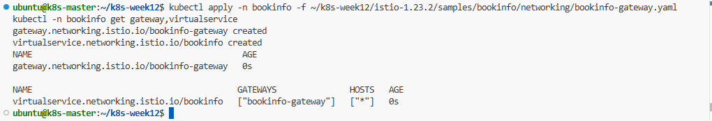

### 2. Ingress Gateway NodePort 로 접근 — EXTERNAL-IP 가 pending 이어도 노드 IP 로 접근 가능

```bash
# NodePort 확인
NODE_PORT=$(kubectl -n istio-system get svc istio-ingressgateway -o jsonpath='{.spec.ports[?(@.name=="http2")].nodePort}')
NODE_IP=$(kubectl get nodes -o jsonpath='{.items[0].status.addresses[?(@.type=="InternalIP")].address}')
echo "Ingress: http://$NODE_IP:$NODE_PORT/productpage"

# 접근 테스트
curl -s -o /dev/null -w "HTTP %{http_code}\n" "http://$NODE_IP:$NODE_PORT/productpage"
# HTTP 200 이 정상
```
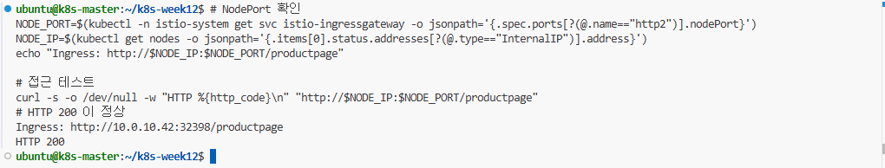

> 브라우저에서 `http://<NODE_IP>:<NODE_PORT>/productpage` 로 접속하면 BookInfo 웹페이지가 보입니다. Reviews 섹션을 새로고침하면 별점(★) 표시 방식이 무작위로 바뀌는 게 reviews v1/v2/v3 의 기본 라운드로빈 동작입니다.

---

## Step 4. 사이드카 패턴 검증 — iptables 리디렉션 (PDF 7쪽)

PDF 7쪽이 설명한 **"iptables 가 파드의 모든 트래픽을 Envoy 로 강제 리디렉션"** 을 직접 확인.

### 1. 사이드카 주입 결과 — initContainer `istio-init` 와 sidecar `istio-proxy`

```bash
POD=$(kubectl -n bookinfo get pod -l app=productpage -o jsonpath='{.items[0].metadata.name}')
kubectl -n bookinfo get pod $POD -o jsonpath='{.spec.initContainers[*].name}{"\n"}{.spec.containers[*].name}{"\n"}'
# 출력:
# istio-init
# productpage istio-proxy
```
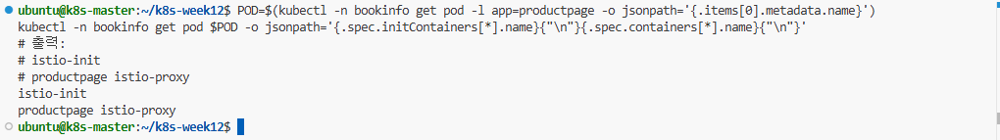

### 2. istio-init 컨테이너가 적용한 iptables 규칙 확인

```bash
# istio-init 의 로그에서 iptables 명령어 확인
kubectl -n bookinfo logs $POD -c istio-init | head -30
# REDIRECT 규칙으로 모든 인바운드 트래픽을 15006 포트(Envoy)로, 아웃바운드를 15001 포트로 보냄
```
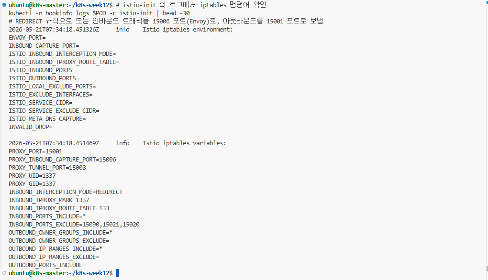

### 3. Envoy 의 listener / cluster 설정 확인

```bash
istioctl proxy-config listener $POD.bookinfo | head -10
istioctl proxy-config cluster $POD.bookinfo | head -10
```
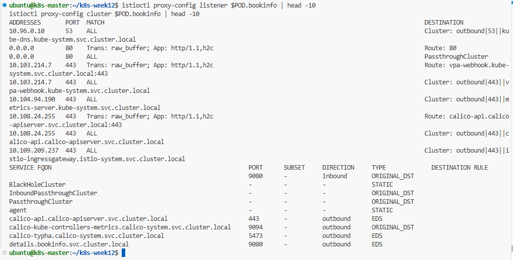

---

## Step 5. 트래픽 관리 ① — 카나리 가중치 분할 (PDF 10, 18쪽)

reviews 서비스의 v1/v2/v3 사이에 트래픽 가중치를 분할합니다.

### 1. DestinationRule — 버전별 subset 정의

```bash
kubectl apply -n bookinfo -f ~/k8s-week12/istio-1.23.2/samples/bookinfo/networking/destination-rule-all.yaml
kubectl -n bookinfo get destinationrules
```
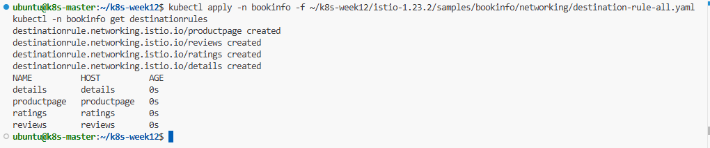

### 2. VirtualService — reviews 트래픽을 v1 80% / v2 20% 로 분할 (PDF p.10 카나리)

```bash
cat > reviews-canary.yaml << 'EOF'
apiVersion: networking.istio.io/v1beta1
kind: VirtualService
metadata:
  name: reviews
  namespace: bookinfo
spec:
  hosts: [reviews]
  http:
    - route:
        - destination: { host: reviews, subset: v1 }
          weight: 80
        - destination: { host: reviews, subset: v2 }
          weight: 20
EOF

kubectl apply -f reviews-canary.yaml
```
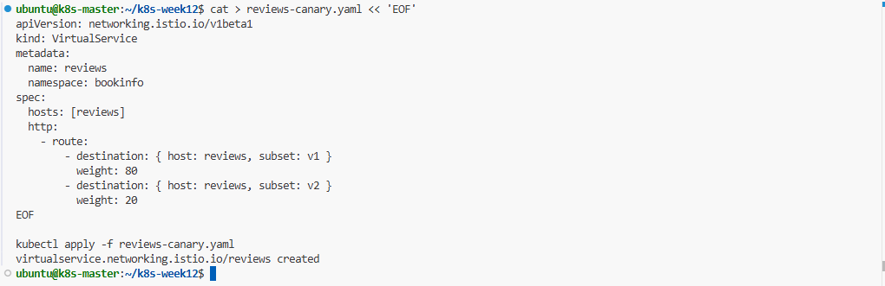

### 3. 트래픽 분할 검증 — 20번 요청 시 약 16:4 비율 관찰

```bash
# 다수 요청 후 reviews v1/v2 의 access log 비교
for i in $(seq 1 20); do
  curl -s "http://$NODE_IP:$NODE_PORT/productpage" > /dev/null
done

echo "=== reviews-v1 ==="
kubectl -n bookinfo logs deploy/reviews-v1 -c istio-proxy 2>/dev/null | grep -c '"GET'

echo "=== reviews-v2 ==="
kubectl -n bookinfo logs deploy/reviews-v2 -c istio-proxy 2>/dev/null | grep -c '"GET'
# 약 80:20 비율로 카운트
```
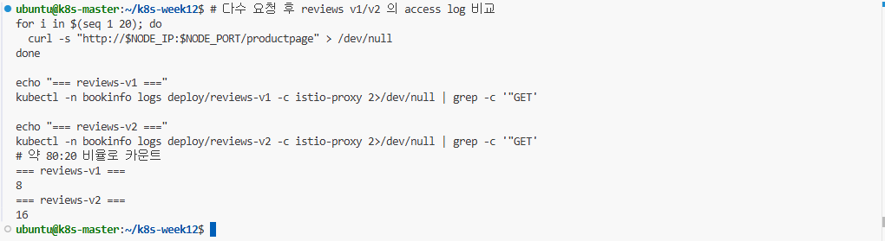

---

## Step 6. 트래픽 관리 ② — 헤더 기반 A/B 테스트 (PDF 18쪽)

특정 사용자(`end-user: tester`)는 v3 로, 나머지는 v1 으로 라우팅 — PDF p.18 그대로.

```bash
cat > reviews-ab.yaml << 'EOF'
apiVersion: networking.istio.io/v1beta1
kind: VirtualService
metadata:
  name: reviews
  namespace: bookinfo
spec:
  hosts: [reviews]
  http:
    - match:
        - headers:
            end-user:
              exact: tester
      route:
        - destination: { host: reviews, subset: v3 }   # 테스터는 v3 (별점 빨간색)
    - route:
        - destination: { host: reviews, subset: v1 }   # 그 외는 v1 (별점 없음)
EOF

kubectl apply -f reviews-ab.yaml
```
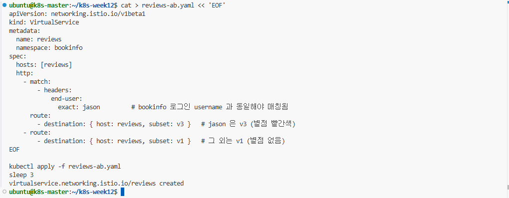

### 검증 — 헤더 유무에 따라 reviews v1/v3 의 access log 가 갈림

```bash
# 1) 일반 요청 10번 — reviews-v1 으로만 가야 함
for i in $(seq 1 10); do
  curl -s -o /dev/null "http://$NODE_IP:$NODE_PORT/productpage"
done

# 2) tester 헤더로 10번 — reviews-v3 으로만 가야 함
for i in $(seq 1 10); do
  curl -s -o /dev/null -H "end-user: tester" "http://$NODE_IP:$NODE_PORT/productpage"
done

# 3) 각 버전의 access log 카운트 비교
echo "=== reviews-v1 (일반 사용자용) ==="
kubectl -n bookinfo logs deploy/reviews-v1 -c istio-proxy --tail=200 2>/dev/null | grep -c '"GET'

echo "=== reviews-v3 (tester 헤더 전용) ==="
kubectl -n bookinfo logs deploy/reviews-v3 -c istio-proxy --tail=200 2>/dev/null | grep -c '"GET'

echo "=== reviews-v2 (이 단계에선 안 호출됨, 0이 정상) ==="
kubectl -n bookinfo logs deploy/reviews-v2 -c istio-proxy --tail=200 2>/dev/null | grep -c '"GET'
```
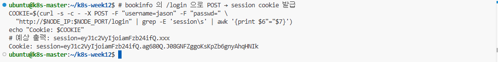

---

## Step 7. 복원력 ① — Timeout 과 Retry (PDF 13쪽)

`ratings` 서비스 호출에 타임아웃 1초와 5xx 응답 시 3회 재시도를 적용.

```bash
cat > ratings-resilience.yaml << 'EOF'
apiVersion: networking.istio.io/v1beta1
kind: VirtualService
metadata:
  name: ratings
  namespace: bookinfo
spec:
  hosts: [ratings]
  http:
    - route:
        - destination: { host: ratings, subset: v1 }
      timeout: 1s                                       # 최대 대기 시간
      retries:
        attempts: 3                                     # 최대 3회 재시도
        perTryTimeout: 500ms
        retryOn: 5xx,gateway-error,connect-failure
EOF

kubectl apply -f ratings-resilience.yaml
kubectl -n bookinfo get vs ratings -o yaml | grep -A2 'timeout\|retries' | head -10
```
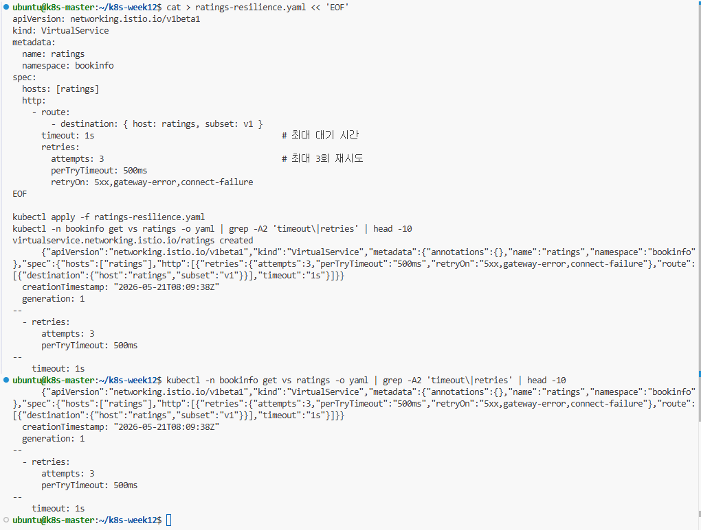

> 실제 시연을 위해선 ratings 에 fault injection (HTTP 500 또는 지연 삽입) 을 함께 걸어야 하지만 본 단계는 **YAML 설정만 적용 + 의도 학습** 까지로 끝냅니다.

---

## Step 8. 복원력 ② — 서킷 브레이커 (PDF 13, 19쪽)

PDF 19쪽 그대로 `outlierDetection` + `connectionPool` 적용.

```bash
cat > reviews-circuit-breaker.yaml << 'EOF'
apiVersion: networking.istio.io/v1beta1
kind: DestinationRule
metadata:
  name: reviews
  namespace: bookinfo
spec:
  host: reviews
  trafficPolicy:
    connectionPool:
      tcp:
        maxConnections: 100
      http:
        http1MaxPendingRequests: 50
        maxRequestsPerConnection: 2
    outlierDetection:
      consecutive5xxErrors: 5         # 5회 연속 5xx 발생 시
      interval: 30s
      baseEjectionTime: 30s            # 30초간 풀에서 제외
      maxEjectionPercent: 50
  subsets:
    - name: v1
      labels: { version: v1 }
    - name: v2
      labels: { version: v2 }
    - name: v3
      labels: { version: v3 }
EOF

kubectl apply -f reviews-circuit-breaker.yaml
kubectl -n bookinfo describe destinationrule reviews | grep -A4 OutlierDetection
```
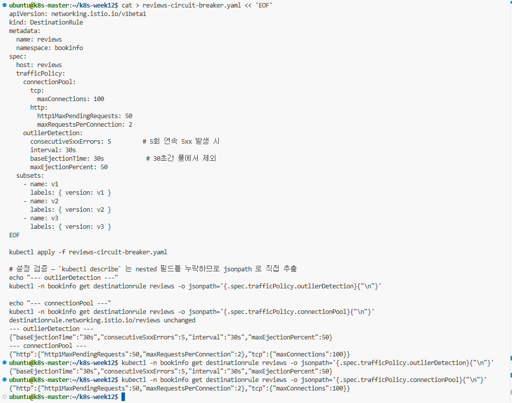

---

## Step 9. 보안 — mTLS 자동 적용 (PDF 11쪽)

Istio 가 사이드카 간 통신을 **자동으로 mTLS 암호화** 합니다. 검증.

### 1. 사이드카가 출발지/도착지에서 사용 중인 mTLS 상태 확인

```bash
# 두 파드 간 mTLS 활성 여부 — Istio 1.20+ 에서는 experimental 카테고리
SRC_POD=$(kubectl -n bookinfo get pod -l app=productpage -o jsonpath='{.items[0].metadata.name}')
istioctl x authn tls-check $SRC_POD.bookinfo reviews.bookinfo.svc.cluster.local
# STATUS: OK + HOST 와 PORT 컬럼이 mTLS 활성으로 표시
```
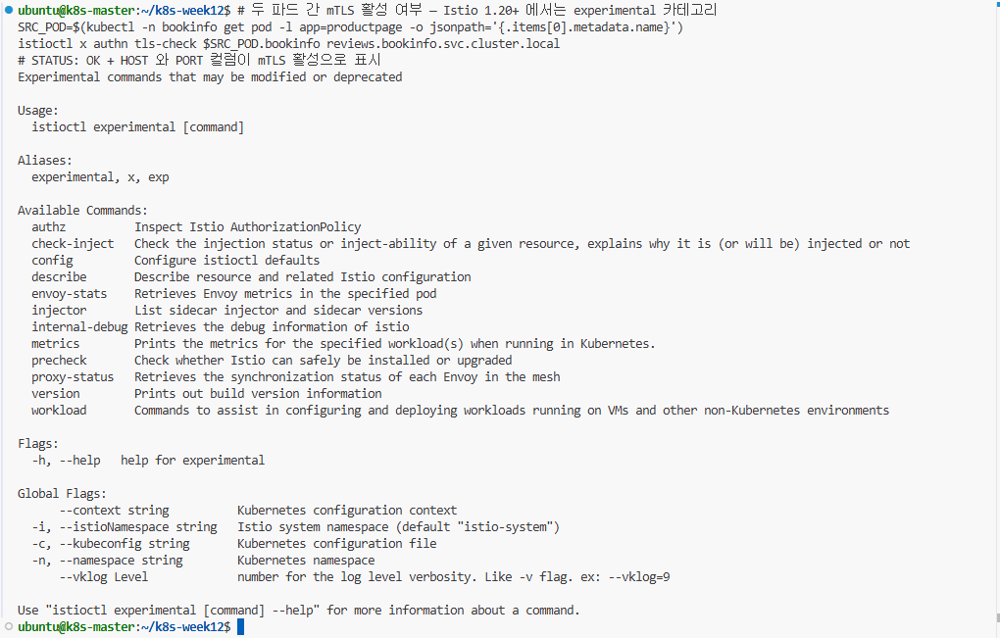

### 2. STRICT 모드 강제 적용 — 사이드카 없는 파드는 통신 거부

```bash
cat > strict-mtls.yaml << 'EOF'
apiVersion: security.istio.io/v1beta1
kind: PeerAuthentication
metadata:
  name: default
  namespace: bookinfo
spec:
  mtls:
    mode: STRICT          # bookinfo NS 내부의 모든 통신은 mTLS 필수
EOF

kubectl apply -f strict-mtls.yaml
```
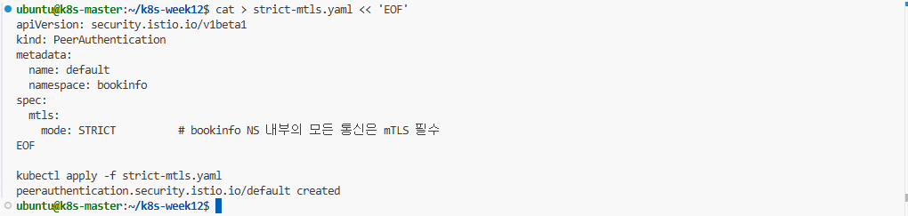

### 3. 검증 — 사이드카 없는 외부 파드에서 호출 시 실패

```bash
# default NS 에 사이드카 없는 파드 띄우기 (이 NS 에는 istio-injection 라벨이 없음)
kubectl run tmp-curl --image=curlimages/curl --restart=Never --rm -it -- \
  sh -c "curl -sS --max-time 5 -o /dev/null -w 'HTTP %{http_code}\n' http://productpage.bookinfo.svc.cluster.local:9080/productpage; echo done"
# HTTP 000 / connection reset — 사이드카 없는 클라이언트는 mTLS 핸드셰이크 못 함 (최대 5초 후 종료)

# 반대로 bookinfo NS 안에서는 정상
kubectl exec -n bookinfo $SRC_POD -c productpage -- \
  curl -sS --max-time 5 -o /dev/null -w "HTTP %{http_code}\n" http://reviews:9080/reviews/0
```
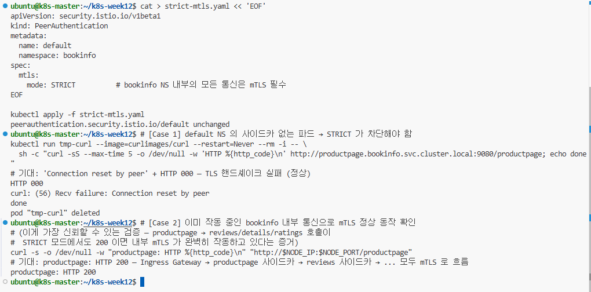

---

## Step 10. 보안 — AuthorizationPolicy (PDF 12, 20쪽)

기본 deny-all → 필요한 호출만 명시적 허용.

### 1. 기본 deny-all 정책

```bash
cat > deny-all.yaml << 'EOF'
apiVersion: security.istio.io/v1beta1
kind: AuthorizationPolicy
metadata:
  name: default-deny
  namespace: bookinfo
spec: {}                  # 빈 spec = 모든 요청 거부
EOF

kubectl apply -f deny-all.yaml

# 적용 후 productpage 호출 시 모든 의존 서비스가 403
sleep 5
curl -s "http://$NODE_IP:$NODE_PORT/productpage" | grep -i "error\|forbidden" | head -3
```
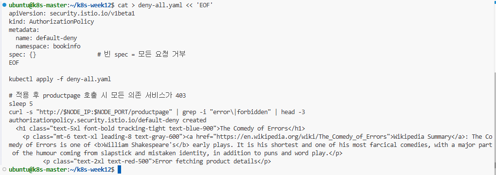

### 2. 필요한 호출만 화이트리스트 허용

```bash
cat > allow-required.yaml << 'EOF'
# productpage 는 외부(Ingress Gateway)에서 GET 허용
apiVersion: security.istio.io/v1beta1
kind: AuthorizationPolicy
metadata: { name: allow-productpage, namespace: bookinfo }
spec:
  selector: { matchLabels: { app: productpage } }
  action: ALLOW
  rules:
    - to: [ { operation: { methods: ["GET"] } } ]
---
# details / reviews 는 productpage SA 에서 GET 허용
apiVersion: security.istio.io/v1beta1
kind: AuthorizationPolicy
metadata: { name: allow-details, namespace: bookinfo }
spec:
  selector: { matchLabels: { app: details } }
  action: ALLOW
  rules:
    - from: [ { source: { principals: ["cluster.local/ns/bookinfo/sa/bookinfo-productpage"] } } ]
      to:   [ { operation: { methods: ["GET"] } } ]
---
apiVersion: security.istio.io/v1beta1
kind: AuthorizationPolicy
metadata: { name: allow-reviews, namespace: bookinfo }
spec:
  selector: { matchLabels: { app: reviews } }
  action: ALLOW
  rules:
    - from: [ { source: { principals: ["cluster.local/ns/bookinfo/sa/bookinfo-productpage"] } } ]
      to:   [ { operation: { methods: ["GET"] } } ]
---
apiVersion: security.istio.io/v1beta1
kind: AuthorizationPolicy
metadata: { name: allow-ratings, namespace: bookinfo }
spec:
  selector: { matchLabels: { app: ratings } }
  action: ALLOW
  rules:
    - from: [ { source: { principals: ["cluster.local/ns/bookinfo/sa/bookinfo-reviews"] } } ]
      to:   [ { operation: { methods: ["GET"] } } ]
EOF

kubectl apply -f allow-required.yaml
sleep 5

# 정상 응답 복구 확인
curl -s -o /dev/null -w "HTTP %{http_code}\n" "http://$NODE_IP:$NODE_PORT/productpage"
```
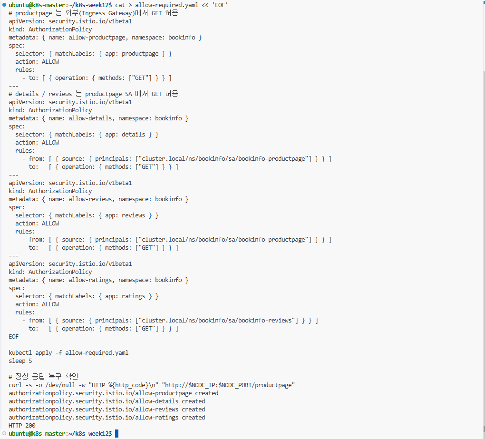

```bash
# 학습 끝나면 정책 정리 (다음 단계 영향 안 받게)
kubectl delete -f deny-all.yaml -f allow-required.yaml -f strict-mtls.yaml
```

---

## Step 11. 관찰성 — Addons 설치 (PDF 14~16, 21쪽)

Prometheus + Grafana + Jaeger + Kiali 한 번에 설치 (Istio 공식 샘플).

```bash
kubectl apply -f ~/k8s-week12/istio-1.23.2/samples/addons/

# Ready 대기 (각자 1~2분 소요)
kubectl -n istio-system rollout status deploy/prometheus --timeout=180s
kubectl -n istio-system rollout status deploy/grafana    --timeout=180s
kubectl -n istio-system rollout status deploy/kiali      --timeout=180s
kubectl -n istio-system rollout status deploy/jaeger     --timeout=180s

kubectl -n istio-system get pods | grep -E 'prometheus|grafana|jaeger|kiali'
```
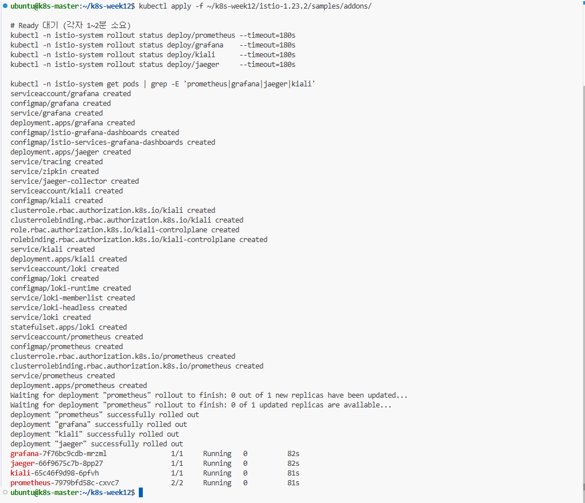

### Kiali 대시보드 접속 (포트포워딩)

```bash
# 백그라운드 포트포워딩 (Master 노드의 20001 → Kiali UI)
kubectl -n istio-system port-forward svc/kiali 20001:20001 --address 0.0.0.0 >/dev/null 2>&1 &
PF_PID=$!
sleep 3
echo "Kiali: http://<Master_IP>:20001"
# 브라우저에서 접속 후 Graph 탭 → Namespace: bookinfo 선택
```
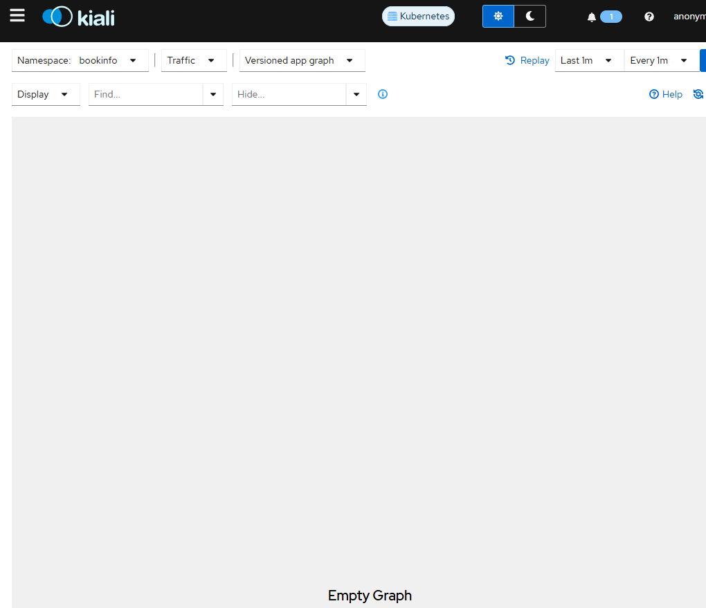

### 트래픽 발생시켜 그래프 채우기

```bash
# 60초 정도 요청을 흘려야 Kiali 그래프가 의미 있게 나옴
for i in $(seq 1 60); do
  curl -s -o /dev/null "http://$NODE_IP:$NODE_PORT/productpage"
  curl -s -o /dev/null -H "end-user: tester" "http://$NODE_IP:$NODE_PORT/productpage"
  sleep 1
done

# 포트포워딩 종료 (브라우저 확인 끝난 뒤)
# kill $PF_PID
```
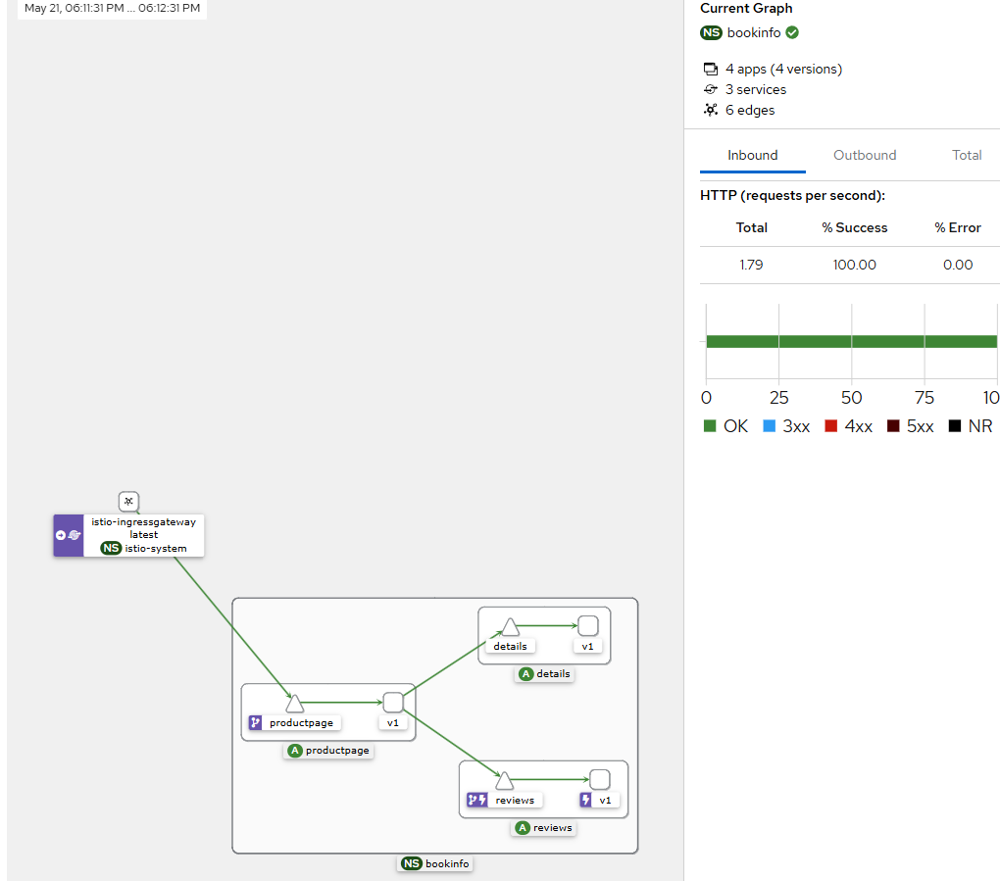

---

## Step 12. 분산 추적 + 토폴로지 시각화 (PDF 15~16쪽)

### 1. Jaeger 분산 추적

```bash
kubectl -n istio-system port-forward svc/tracing 16686:80 --address 0.0.0.0 >/dev/null 2>&1 &
TR_PID=$!
sleep 3
echo "Jaeger: http://<Master_IP>:16686"
# Service 드롭다운에서 productpage.bookinfo 선택 → Find Traces
# 한 요청이 productpage → details / reviews → ratings 로 흐르는 Span 들을 확인
```
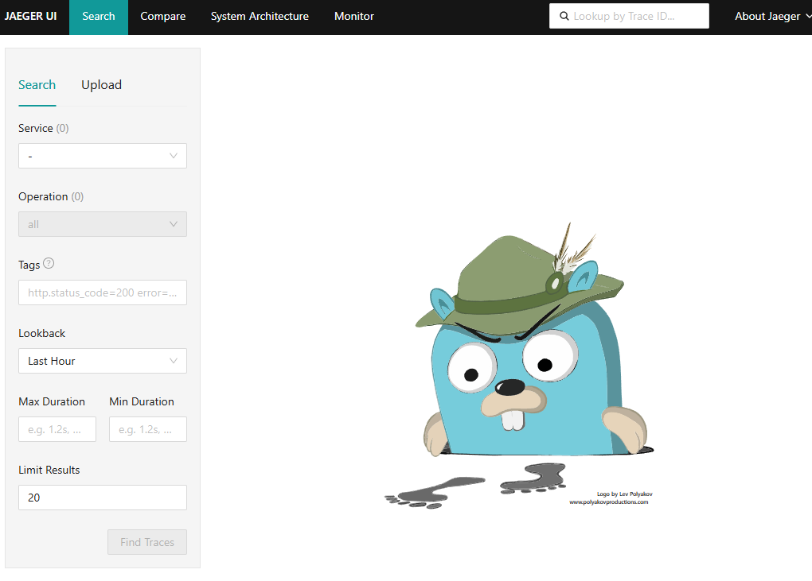

### 2. Grafana 메트릭 대시보드

```bash
kubectl -n istio-system port-forward svc/grafana 3000:3000 --address 0.0.0.0 >/dev/null 2>&1 &
GR_PID=$!
sleep 3
echo "Grafana: http://<Master_IP>:3000"
# Dashboards → Istio → Istio Service Dashboard 에서 reviews / productpage 별 RPS, Latency, Error rate 확인
```
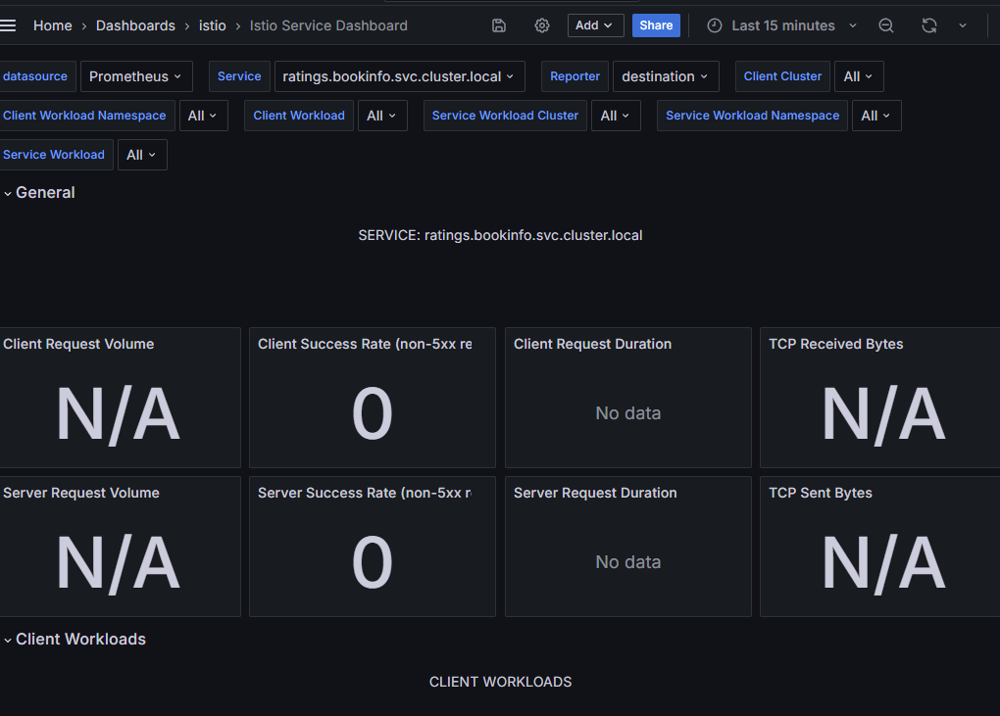

> 4대 Golden Signals (PDF 14쪽) — Latency / Traffic / Errors / Saturation — 가 한 화면에 시각화됩니다.

```bash
# 모든 포트포워딩 정리
kill $PF_PID $TR_PID $GR_PID 2>/dev/null
```

---

## Step 13. Linkerd 와 Consul 비교 학습 (PDF 23~30쪽)

> **주의**: Istio 가 이미 설치된 클러스터에 Linkerd 나 Consul 을 동시에 설치하면 사이드카 충돌이 발생합니다. 본 실습 환경에서는 **개념과 YAML 골격만** 학습하고, 실제 시연은 별도 클러스터에서 진행하세요.

### Linkerd 의 차별점 (PDF 23~25쪽)

| 항목 | Istio | Linkerd |
|---|---|---|
| 프록시 | Envoy (C++) | linkerd2-proxy (Rust, 더 가벼움) |
| 설치 | `istioctl install --set profile=demo` | `linkerd install \| kubectl apply -f -` |
| 사이드카 주입 | NS 라벨 `istio-injection=enabled` | `kubectl ... \| linkerd inject - \| kubectl apply -f -` |
| 카나리 배포 | VirtualService weights | SMI TrafficSplit `weight: 900m/100m` |
| 복원력 | VirtualService timeout/retries + DR outlierDetection | HTTPRoute timeouts/retry |

**Linkerd TrafficSplit 예시** (PDF 24쪽):

```yaml
# 참고용 — 본 실습 클러스터에서는 적용하지 마세요
apiVersion: split.smi-spec.io/v1alpha1
kind: TrafficSplit
metadata: { name: my-service-split }
spec:
  service: my-service
  backends:
    - service: my-service-v1
      weight: 900m
    - service: my-service-v2
      weight: 100m
```

**Linkerd HTTPRoute — Timeout / Retry 구성 예시** (PDF 25쪽):

```yaml
# 참고용 — Istio 의 VirtualService timeout/retries 와 동등한 기능
apiVersion: policy.linkerd.io/v1beta2
kind: HTTPRoute
metadata: { name: authors-route }
spec:
  parentRefs:
    - name: authors-svc
      kind: Service
      group: core
  rules:
    - matches:
        - path:
            value: "/authors"
      timeouts:
        request: 2s          # 최대 2초 대기
      retry:
        limit: 3             # 최대 3회 재시도
        conditions:
          - "5xx"            # 5xx 오류 발생 시에만 재시도
```

### Consul 의 차별점 (PDF 27~29쪽)

| 항목 | Istio | Consul |
|---|---|---|
| 메인 강점 | K8s 네이티브 + 풍부한 기능 | **VM·베어메탈·멀티 데이터센터** 통합 |
| 합의 알고리즘 | (해당 없음, etcd 사용) | **Raft + Gossip(Serf)** |
| 트래픽 분할 | VirtualService | **ServiceResolver + ServiceSplitter** 조합 |
| 보안 정책 | AuthorizationPolicy | **ServiceIntentions** (deny-all 기본 + 명시 허용) |

**Consul ServiceIntentions 예시** (PDF 28쪽):

```yaml
# 참고용
apiVersion: consul.hashicorp.com/v1alpha1
kind: ServiceIntentions
metadata: { name: backend-intentions }
spec:
  destination: { name: backend }
  sources:
    - name: frontend
      action: allow
    - name: web
      permissions:
        - { action: allow, http: { pathExact: "/api/v1/data", methods: [GET] } }
        - { action: deny,  http: { pathPrefix: "/admin" } }
```

**Consul 트래픽 분할 — ServiceResolver + ServiceSplitter** (PDF 29쪽):

```yaml
# 1) ServiceResolver — 메타데이터 기반 서브셋 정의
apiVersion: consul.hashicorp.com/v1alpha1
kind: ServiceResolver
metadata: { name: backend }
spec:
  defaultSubset: v1
  subsets:
    v1:
      filter: 'Service.Meta.version == v1'
    v2:
      filter: 'Service.Meta.version == v2'
---
# 2) ServiceSplitter — 정의된 서브셋 간 트래픽 가중치 (Istio VirtualService weight 와 동등)
apiVersion: consul.hashicorp.com/v1alpha1
kind: ServiceSplitter
metadata: { name: backend }
spec:
  splits:
    - weight: 90
      serviceSubset: v1
    - weight: 10
      serviceSubset: v2
```

### 선택 가이드 (PDF 31~32쪽)

- **엔터프라이즈 + 복잡한 트래픽/보안 제어** → **Istio**
- **소규모 + 가볍게 mTLS·메트릭만** → **Linkerd**
- **VM·하이브리드·멀티 DC** → **Consul**

---

## Step 14. 리소스 정리

```bash
# Step 5~10 에서 만든 정책/규칙
kubectl delete -f reviews-canary.yaml --ignore-not-found
kubectl delete -f reviews-ab.yaml --ignore-not-found
kubectl delete -f ratings-resilience.yaml --ignore-not-found
kubectl delete -f reviews-circuit-breaker.yaml --ignore-not-found
kubectl delete -f strict-mtls.yaml -f deny-all.yaml -f allow-required.yaml --ignore-not-found

# bookinfo 앱 + 네임스페이스
kubectl delete -n bookinfo -f ~/k8s-week12/istio-1.23.2/samples/bookinfo/networking/bookinfo-gateway.yaml --ignore-not-found
kubectl delete -n bookinfo -f ~/k8s-week12/istio-1.23.2/samples/bookinfo/networking/destination-rule-all.yaml --ignore-not-found
kubectl delete -n bookinfo -f ~/k8s-week12/istio-1.23.2/samples/bookinfo/platform/kube/bookinfo.yaml --ignore-not-found
kubectl delete namespace bookinfo --ignore-not-found

# 관찰성 addons
kubectl delete -f ~/k8s-week12/istio-1.23.2/samples/addons/ --ignore-not-found
```
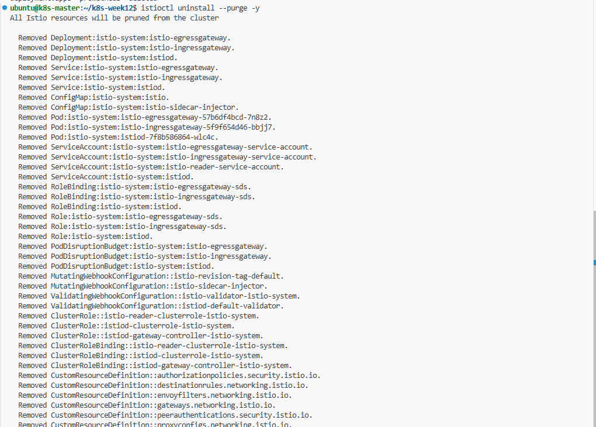

```bash
# (선택) Istio 자체를 완전히 제거하려면
# istioctl uninstall --purge -y
# kubectl delete namespace istio-system
```

---

## 트러블슈팅 체크리스트

| 증상 | 주요 원인 / 조치 |
| :--- | :--- |
| `istioctl install` 이 OOMKilled / 노드 메모리 부족 | demo 프로파일이 컨트롤 플레인 + Ingress + Egress 다 띄움 → `default` 프로파일로 변경, 또는 워커 메모리 확인 |
| bookinfo 파드가 1/1 (사이드카 미주입) | `istio-injection=enabled` 라벨이 NS 에 없음 / 라벨 추가 후 파드 재생성 필요 — `kubectl rollout restart deploy -n bookinfo` |
| Ingress Gateway EXTERNAL-IP `<pending>` | Week 10 과 동일 — MetalLB 부재로 정상. NodePort 로 접근 |
| `curl /productpage` 가 503 | productpage Pod 가 아직 Ready 가 아님 / VirtualService selector 불일치 → `istioctl analyze -n bookinfo` 로 진단 |
| Kiali 그래프가 비어 있음 | 메트릭 수집까지 1~2분 소요 + 트래픽 부족 → `for i in $(seq 1 60); do curl ...; done` 로 트래픽 발생시키기 |
| mTLS STRICT 적용 후 정상 통신도 막힘 | 외부 클라이언트(NS 외부 / 사이드카 없음)에서 호출 시 정상 차단 / 내부 통신은 PeerAuthentication scope 확인 |
| AuthorizationPolicy 가 즉시 반영 안 됨 | Envoy 설정 전파에 수 초 소요 → `istioctl proxy-config secret <pod>` 로 SDS 확인 |
| `istioctl proxy-config` 가 빈 출력 | 파드 이름에 `.namespace` 가 빠짐 — `pod-name.bookinfo` 형식으로 |
| Jaeger 에 trace 가 안 보임 | 샘플링 비율 기본 1% — `meshConfig.defaultConfig.tracing.sampling=100` 으로 데모 시 100% 권장 |
| 사이드카 주입 후 파드가 CrashLoopBackOff | 노드의 CPU/메모리 압박 / `kubectl describe pod` 에서 OOM 또는 init 컨테이너 실패 확인 |
| Step 13 의 Linkerd/Consul YAML 을 그대로 apply | Istio CRD 와 다른 그룹이라 apply 자체는 가능하지만 동작 X — **CRD 미설치 상태**라 처음에 NotFound 에러로 안전 차단 |
| 새 SSH 세션에서 `istioctl: command not found` | `export PATH=$PATH` 가 세션에 종속됨 — 영구화하려면 `echo 'export PATH=~/k8s-week12/istio-1.23.2/bin:$PATH' >> ~/.bashrc && source ~/.bashrc` |
