# 13. CRD & Admission Controller

> 본 실습은 **Master 1 + Worker 2 (총 3노드) 클러스터** 를 기준으로 합니다. **Python kopf** 프레임워크로 Custom Controller 와 Admission Webhook 을 한 번에 다룹니다 (PDF p.24 권장 — "빠른 프로토타이핑").
>
> 12주차의 Istio 가 설치되어 있어도 무관합니다. 본 실습은 별도 네임스페이스 `crd-lab` 에서 진행합니다.

---

## Step 0. 작업 폴더 & 사전 도구 설치

> Step 7~11 의 Controller 와 Webhook 이 모두 Python `kopf` 위에서 돌아갑니다. 시스템 Python 을 건드리지 않게 가상환경으로 격리하고, 다른 주차 리소스와 섞이지 않도록 전용 네임스페이스 `crd-lab` 을 만들어 둡니다.

### 1. 작업 디렉터리

```bash
mkdir -p ~/k8s-week13
cd ~/k8s-week13
```
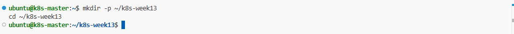

### 2. Python 도구 설치 (kopf + kubernetes client)

```bash
sudo apt -y install python3-pip python3-venv

# 가상환경으로 깔끔하게 격리
python3 -m venv ~/k8s-week13/venv
source ~/k8s-week13/venv/bin/activate
pip install --upgrade pip
pip install "kopf>=1.37" "kubernetes>=29" pyyaml

# 설치 확인
kopf --version
python -c "import kubernetes; print(kubernetes.__version__)"
```

> 📌 **새 터미널을 열 때마다** `kopf` 나 `python` 명령을 실행할 거라면 venv 활성화가 필요합니다. `kubectl` 만 쓰는 터미널은 무관.
> ```bash
> cd ~/k8s-week13
> source venv/bin/activate
> ```
> 본 실습 자료의 Step 6·7·10·11 의 `kopf run` / `python` 명령 앞에는 활성화 라인이 함께 적혀 있습니다.
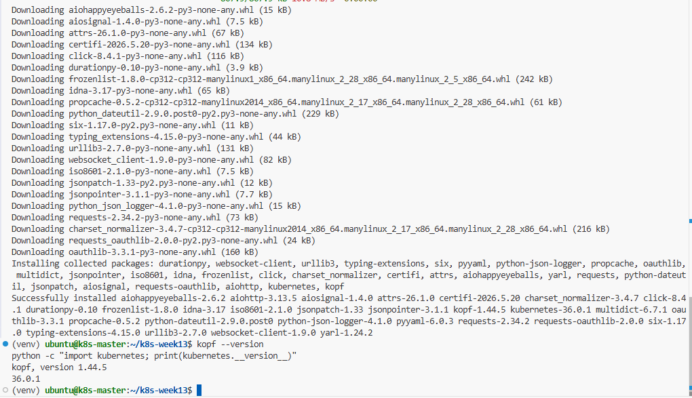

### 3. 전용 네임스페이스 생성

```bash
kubectl create namespace crd-lab
kubectl config set-context --current --namespace=crd-lab
```
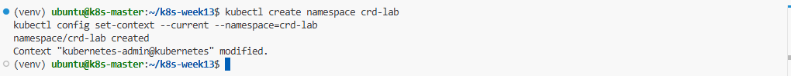

---

## Step 1. Kubernetes API 탐색 (PDF 2, 4쪽)

> CRD 는 결국 새로운 GVR(Group/Version/Resource) 을 API Server 에 등록하는 작업입니다. 그래서 기존 리소스들이 어떤 GVR 체계로 식별되는지부터 들여다봅니다. `kubectl api-resources`, `kubectl explain`, `--raw` 호출로 API Server 의 내부 구조를 직접 살펴보면 Step 3 에서 내가 만들 CRD 가 어디에 끼는지 자연스럽게 그려집니다.

### 1. 모든 리소스의 GVR 한 번에 보기

```bash
# Group / Version / Resource 형식으로 출력
kubectl api-resources -o wide | head -20

# Core 그룹 (group 비어있음) — /api/v1
kubectl api-resources --api-group="" | head -10

# apps 그룹 — /apis/apps/v1
kubectl api-resources --api-group=apps
```
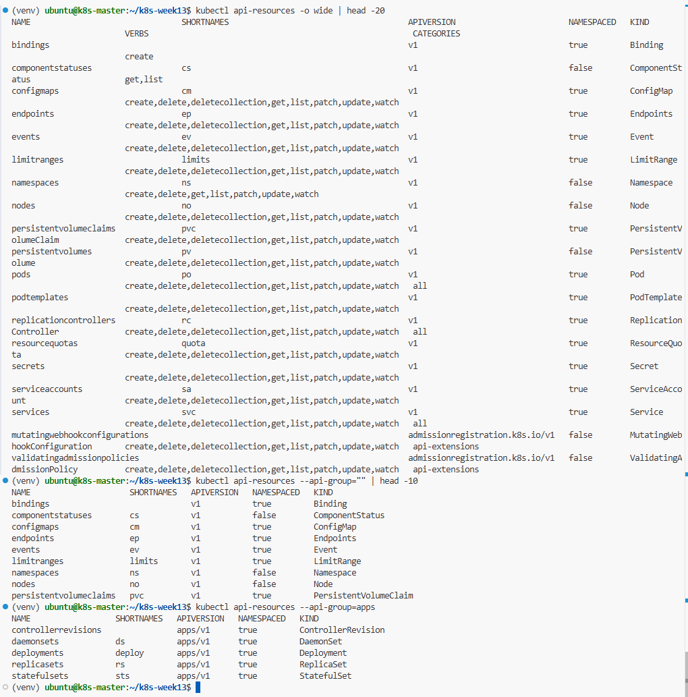

### 2. API 스키마 탐색 — `kubectl explain`

```bash
# Pod 의 spec 필드 구조
kubectl explain pod.spec.containers --recursive | head -30

# API 그룹/버전 확인
kubectl api-versions | head -20
```
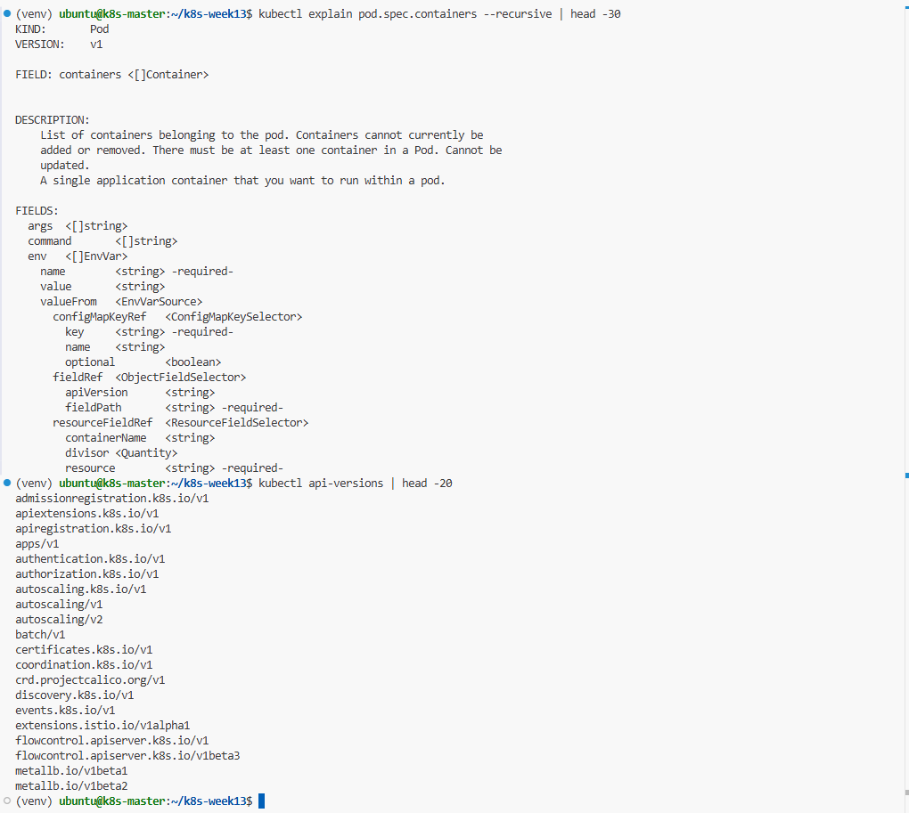

### 3. API Server 직접 호출 — Authentication/Authorization 통과 흐름 확인

```bash
# 현재 kubeconfig 의 토큰으로 직접 REST 호출
TOKEN=$(kubectl get secret -n kube-system -o name | grep -m1 default-token 2>/dev/null \
        | xargs -I {} kubectl get -n kube-system {} -o jsonpath='{.data.token}' 2>/dev/null | base64 -d) || \
TOKEN=$(kubectl create token default 2>/dev/null)

APISERVER=$(kubectl config view --minify -o jsonpath='{.clusters[0].cluster.server}')
echo "API: $APISERVER"

# /apis 로 그룹 목록 조회
kubectl get --raw /apis | python3 -m json.tool | head -20
```
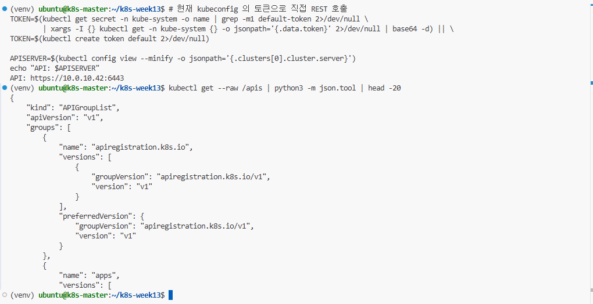

---

## Step 2. List-Watch 메커니즘 체험 (PDF 6쪽)

> Controller, Operator, `kubectl -w` 가 모두 같은 List-Watch 메커니즘 위에서 동작합니다. Polling 없이 어떻게 실시간으로 변경 이벤트를 받는지 직접 보면, Step 6 의 Informer 와 Step 7 의 Controller 가 자연스럽게 이어집니다. Pod 변경 시 `ADDED → MODIFIED → DELETED` 가 흐르는 스트림을 두 가지 방식(kubectl, raw HTTP)으로 관찰합니다.

### 1. `kubectl -w` 로 실시간 이벤트 수신

```bash
# 별도 터미널 A — watch 모드로 대기
kubectl get pods -w

# 별도 터미널 B — Pod 생성/삭제로 ADDED/MODIFIED/DELETED 이벤트 발생
kubectl run busybox --image=busybox --restart=Never -- sleep 3600
sleep 5
kubectl delete pod busybox
```

터미널 A 에서 `ADDED → MODIFIED(여러 번) → DELETED` 가 실시간으로 흐르는 것 관찰.

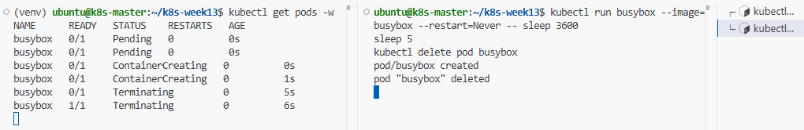

### 2. raw HTTP 스트림으로 보기 — `kubectl get --raw`

```bash
# resourceVersion 부터 시작하는 watch 스트림 (JSON line-delimited)
RV=$(kubectl get pods -o jsonpath='{.metadata.resourceVersion}')
echo "Starting from RV=$RV"

# 별도 터미널에서 호출하면 새 Pod 생성 시 line 으로 들어옴 (Ctrl+C 종료)
kubectl get --raw "/api/v1/namespaces/crd-lab/pods?watch=true&resourceVersion=$RV" | head -5
```
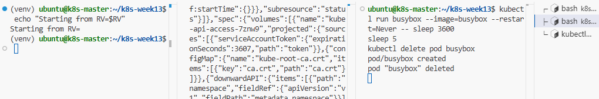

---

## Step 3. CRD 생성 — Website CRD (PDF 12~15쪽)

> Pod 나 Deployment 같은 내장 리소스로 표현하기 어려운 도메인 개념(예: "웹사이트")을 Kubernetes 의 1급 시민으로 만드는 게 CRD 의 본질입니다. Website CRD 를 등록하고 나면 `kubectl get websites` 가 즉시 동작하고, RBAC·Audit·Webhook 같은 기존 메커니즘이 그대로 적용됩니다.

### 1. Website CRD 매니페스트 — PDF p.13 + Validation 규칙 풍부히

```bash
cat > website-crd.yaml << 'EOF'
apiVersion: apiextensions.k8s.io/v1
kind: CustomResourceDefinition
metadata:
  name: websites.example.com           # <plural>.<group> 형식 필수
spec:
  group: example.com
  scope: Namespaced
  names:
    plural: websites
    singular: website
    kind: Website
    shortNames: [web]
  versions:
    - name: v1
      served: true                     # API 노출
      storage: true                    # etcd 저장 기준 (반드시 한 버전만)
      subresources:
        status: {}                     # /status 서브리소스 활성화 (PDF p.18)
      schema:
        openAPIV3Schema:
          type: object
          properties:
            spec:
              type: object
              required: [image, replicas]     # 필수 필드
              properties:
                image:
                  type: string
                  pattern: '^[a-z0-9./:_-]+$'  # 이미지명 형식 검증
                  minLength: 3
                replicas:
                  type: integer
                  minimum: 1
                  maximum: 10
                  default: 1
                tier:
                  type: string
                  enum: [dev, stage, prod]    # 화이트리스트
                  default: dev
            status:
              type: object
              properties:
                availableReplicas:
                  type: integer
                phase:
                  type: string
      additionalPrinterColumns:
        - name: Image
          type: string
          jsonPath: .spec.image
        - name: Replicas
          type: integer
          jsonPath: .spec.replicas
        - name: Tier
          type: string
          jsonPath: .spec.tier
        - name: Available
          type: integer
          jsonPath: .status.availableReplicas
        - name: Age
          type: date
          jsonPath: .metadata.creationTimestamp
EOF

kubectl apply -f website-crd.yaml

# 등록 즉시 kubectl 에 새 리소스가 인식됨
kubectl get crd websites.example.com
kubectl api-resources | grep websites
```
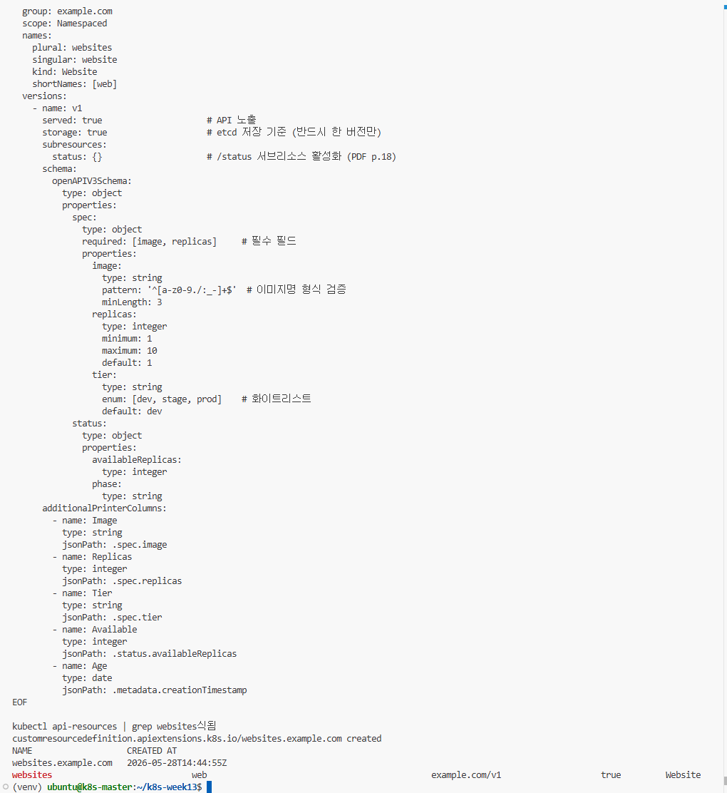

### 2. 새 리소스가 standard kubectl 명령에 즉시 통합되는지 확인

```bash
kubectl explain website.spec
kubectl explain website.status
```
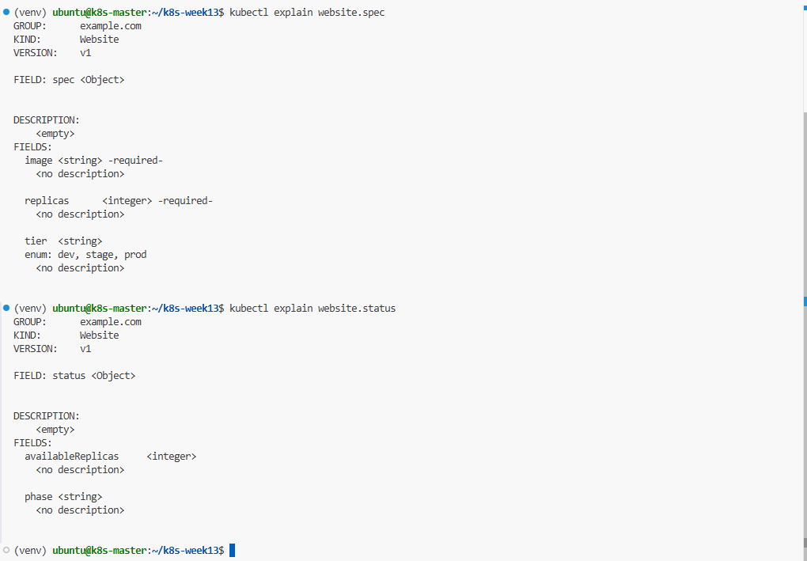

---

## Step 4. Custom Resource 생성 + Validation 검증 (PDF 14~15쪽)

> CRD 의 진짜 가치는 저장이 아니라 스키마 검증입니다. 잘못된 데이터가 API Server 단계에서 거부되어 etcd 에 도달하지 않으므로, Controller 가 예외 케이스를 일일이 처리할 부담이 줄어듭니다. 정상 케이스와 위반 케이스를 모두 시도해서 `required`, `maximum`, `enum`, `pattern`, `default` 가 실제로 어떻게 작동하는지 확인합니다.

### 1. 정상 케이스 — 모든 검증 통과

```bash
cat > my-blog.yaml << 'EOF'
apiVersion: example.com/v1
kind: Website
metadata:
  name: my-blog
spec:
  image: nginx:1.27
  replicas: 3
  tier: dev
EOF

kubectl apply -f my-blog.yaml
kubectl get websites
kubectl get web                 # shortName 도 동작
```
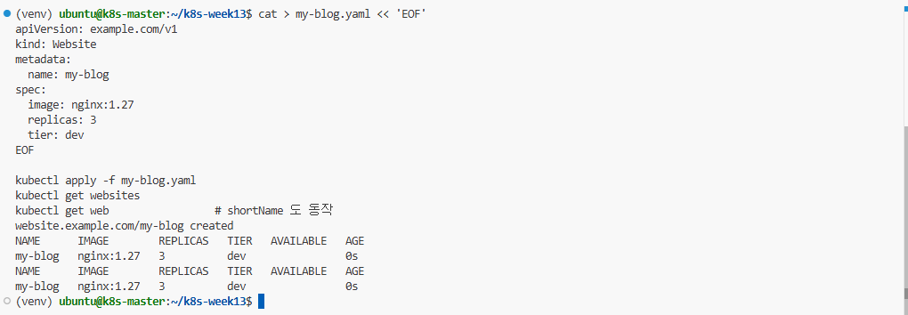

### 2. 검증 실패 케이스 — API Server 가 400 으로 거부

```bash
# Case A: replicas 가 maximum=10 초과
cat <<'EOF' | kubectl apply -f - 2>&1 | tail -5
apiVersion: example.com/v1
kind: Website
metadata: { name: too-many }
spec: { image: nginx, replicas: 99, tier: dev }
EOF
# 기대: spec.replicas: must be less than or equal to 10

# Case B: tier enum 위반
cat <<'EOF' | kubectl apply -f - 2>&1 | tail -5
apiVersion: example.com/v1
kind: Website
metadata: { name: wrong-tier }
spec: { image: nginx, replicas: 1, tier: testing }
EOF
# 기대: spec.tier: Unsupported value: "testing"

# Case C: 필수 필드 누락
cat <<'EOF' | kubectl apply -f - 2>&1 | tail -5
apiVersion: example.com/v1
kind: Website
metadata: { name: missing-image }
spec: { replicas: 1 }
EOF
# 기대: spec.image: Required value
```
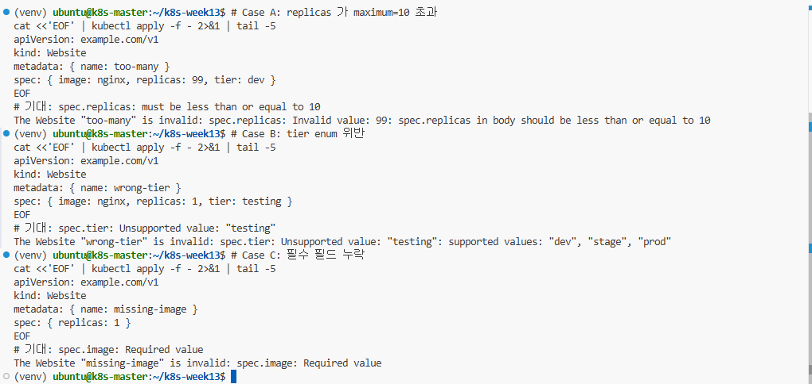

### 3. default 값 자동 주입 확인

```bash
cat <<'EOF' | kubectl apply -f -
apiVersion: example.com/v1
kind: Website
metadata: { name: minimal }
spec: { image: nginx, replicas: 2 }    # tier 생략 → 'dev' 자동 적용
EOF

# tier 가 자동으로 'dev' 로 채워진 것 확인
kubectl get website minimal -o jsonpath='{.spec.tier}{"\n"}'
# 출력: dev
```
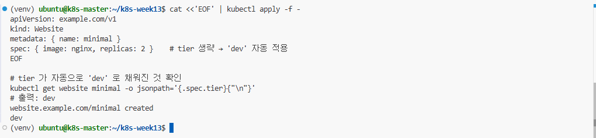

---

## Step 5. Status Subresource 관찰 (PDF 18쪽)

> 사용자가 정의하는 의도(spec) 와 시스템이 관찰한 상태(status) 를 분리하는 게 Controller 패턴 안전성의 출발점입니다. 일반 patch 로는 status 가 안 바뀌고 `--subresource=status` 로만 가능한 것을 직접 확인해두면, Step 7 의 Controller 가 왜 이 경로를 쓰는지 미리 체감할 수 있습니다.

### 1. spec 과 status 의 권한 분리 — 일반 사용자는 status 수정 불가

```bash
# spec 은 사용자가 수정 가능 — kubectl edit / patch 로 변경 OK
kubectl patch website my-blog --type=merge -p '{"spec":{"replicas":5}}'
kubectl get website my-blog -o jsonpath='{.spec.replicas}{"\n"}'

# status 는 /status 서브리소스로만 수정 가능
# 일반 patch 로 status 수정 시도 → 무시됨 (또는 거부)
kubectl patch website my-blog --type=merge -p '{"status":{"phase":"Running"}}'
kubectl get website my-blog -o jsonpath='{.status}{"\n"}'
# status 가 비어있거나 변경 안 됨

# /status 서브리소스로 명시 호출하면 가능 (Controller 가 이 경로 사용)
kubectl patch website my-blog --subresource=status --type=merge \
  -p '{"status":{"phase":"Manual","availableReplicas":0}}'
kubectl get website my-blog -o jsonpath='{.status}{"\n"}'
```
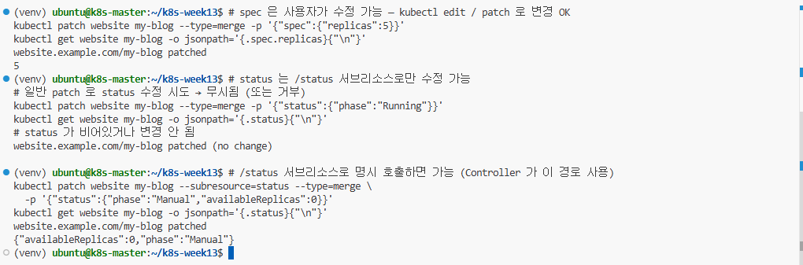

---

## Step 6. CRD 모니터링 (PDF 19~20쪽)

> CRD 를 만들었으니 이제 누가 어떻게 변경하는지 관찰하는 단계가 필요합니다. 이게 Controller 의 첫 동작(Observe)이기도 합니다. CLI 기반의 `kubectl -w` 와 Python Dynamic Informer 두 방식을 비교하면서, 같은 List-Watch 위에서 도구마다 어떤 식으로 활용되는지 살펴봅니다.

### 1. `kubectl -w` — 가장 단순한 디버깅용

```bash
# 별도 터미널 — Website 이벤트 감시
kubectl get websites -w
```

```bash
# 다른 터미널에서 변경 발생
kubectl patch website my-blog --type=merge -p '{"spec":{"replicas":4}}'
sleep 2
kubectl delete website minimal
```

`MODIFIED → DELETED` 이벤트가 즉시 출력됨.

### 2. Python Dynamic Informer — 범용 도구

```bash
cat > dynamic_watch.py << 'EOF'
from kubernetes import client, config, watch

config.load_kube_config()  # 또는 load_incluster_config()
api = client.CustomObjectsApi()

w = watch.Watch()
print("[watching websites.example.com/v1 ...]")
for event in w.stream(
    api.list_namespaced_custom_object,
    group="example.com", version="v1",
    namespace="crd-lab", plural="websites",
    timeout_seconds=120,
):
    obj = event["object"]
    print(f"{event['type']:<8} {obj['metadata']['name']:<15} "
          f"replicas={obj.get('spec', {}).get('replicas')} "
          f"tier={obj.get('spec', {}).get('tier')}")
EOF

source venv/bin/activate     # 새 터미널이면 venv 활성화 필요
python3 dynamic_watch.py &
DYN_PID=$!
sleep 2

# 변경 발생시키기
kubectl patch website my-blog --type=merge -p '{"spec":{"replicas":7}}'
sleep 3

kill $DYN_PID 2>/dev/null
```
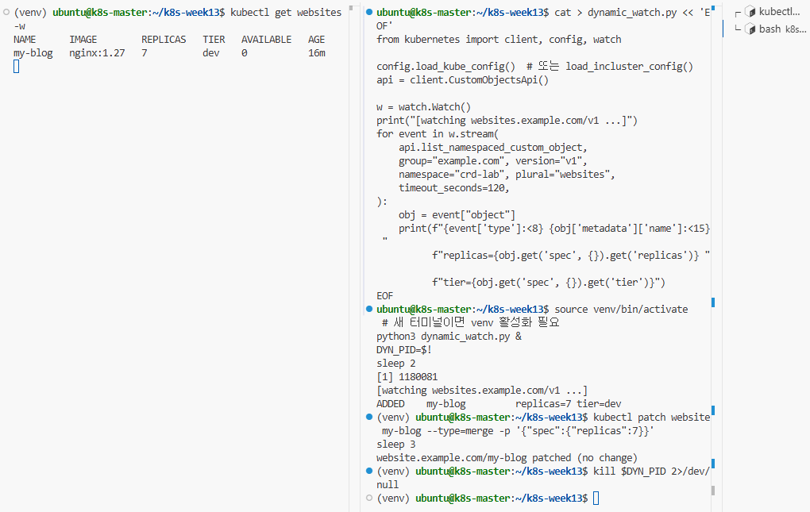

---

## Step 7. Custom Controller — Python kopf (PDF 21~25쪽)

> CRD 만 등록해두면 결국 데이터 저장소에 그칩니다. 실제 동작(Website 가 생기면 Deployment 도 함께 만들기, status 업데이트 등)을 부여하는 게 Controller 의 역할입니다. Reconcile 루프(Observe → Analyze → Act)가 어떻게 Desired 와 Current 를 끊임없이 맞춰가는지 Python kopf 로 직접 구현해 봅니다.

### 1. kopf 컨트롤러 작성

```bash
cat > website_controller.py << 'EOF'
import kopf
import kubernetes
from kubernetes import client

# Website 생성 또는 spec 변경 시 호출됨 (Reconcile)
@kopf.on.create('example.com', 'v1', 'websites')
@kopf.on.update('example.com', 'v1', 'websites')
def reconcile_website(spec, name, namespace, patch, logger, **_):
    image = spec.get('image')
    replicas = spec.get('replicas', 1)

    # ① Compute Desired — 자식 Deployment 명세 생성
    deployment = {
        "apiVersion": "apps/v1",
        "kind": "Deployment",
        "metadata": {"name": f"{name}-web", "namespace": namespace,
                     "labels": {"owner": name, "managed-by": "website-operator"}},
        "spec": {
            "replicas": replicas,
            "selector": {"matchLabels": {"app": name}},
            "template": {
                "metadata": {"labels": {"app": name}},
                "spec": {"containers": [{
                    "name": "web", "image": image,
                    "ports": [{"containerPort": 80}],
                }]},
            },
        },
    }

    # ② Apply — Create or Update (멱등성)
    apps = client.AppsV1Api()
    try:
        apps.create_namespaced_deployment(namespace=namespace, body=deployment)
        logger.info(f"Deployment {name}-web created")
    except kubernetes.client.exceptions.ApiException as e:
        if e.status == 409:        # 이미 존재 — 업데이트
            apps.patch_namespaced_deployment(
                name=f"{name}-web", namespace=namespace, body=deployment)
            logger.info(f"Deployment {name}-web updated")
        else:
            raise

    # ③ Update Status — Website 의 status 서브리소스에 기록
    patch.status['phase'] = 'Running'
    patch.status['availableReplicas'] = replicas

# Website 삭제 시 자식 Deployment 도 정리
@kopf.on.delete('example.com', 'v1', 'websites')
def cleanup(name, namespace, logger, **_):
    try:
        client.AppsV1Api().delete_namespaced_deployment(
            name=f"{name}-web", namespace=namespace)
        logger.info(f"Deployment {name}-web deleted")
    except kubernetes.client.exceptions.ApiException as e:
        if e.status != 404:
            raise
EOF
```
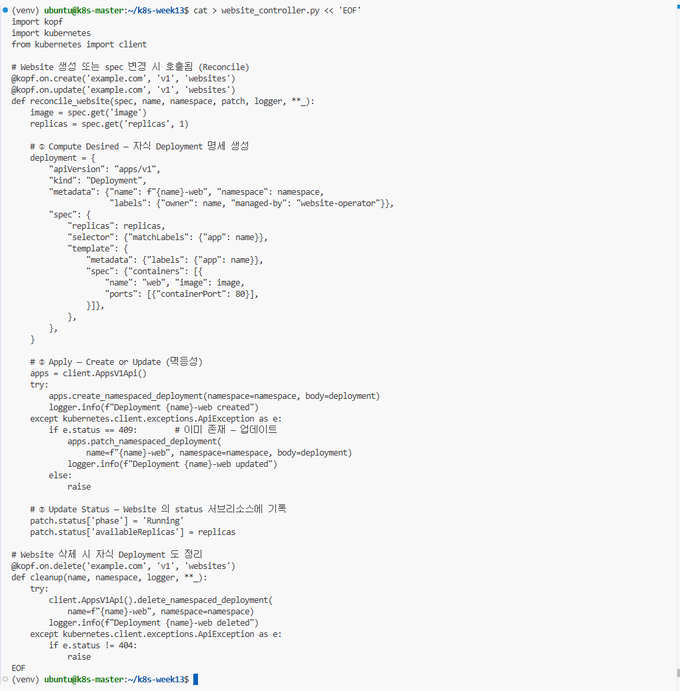

### 2. 컨트롤러 실행 (포어그라운드 — 로그 관찰)

```bash
# 별도 터미널에서 실행 — Ctrl+C 로 종료
source venv/bin/activate     # 새 터미널이면 venv 활성화 필요
kopf run --namespace=crd-lab website_controller.py --verbose
```

### 3. Website 생성 → 자동으로 Deployment 생성되는지 검증

```bash
# (원래 터미널에서) 새 Website 만들기
cat <<'EOF' | kubectl apply -f -
apiVersion: example.com/v1
kind: Website
metadata: { name: hello }
spec: { image: nginx:1.27, replicas: 2, tier: dev }
EOF

sleep 5

# Controller 가 만든 Deployment 확인
kubectl get deploy -l owner=hello
kubectl get pods -l app=hello

# Website 의 status 가 채워졌는지 확인
kubectl get website hello -o jsonpath='{.status}{"\n"}'
```
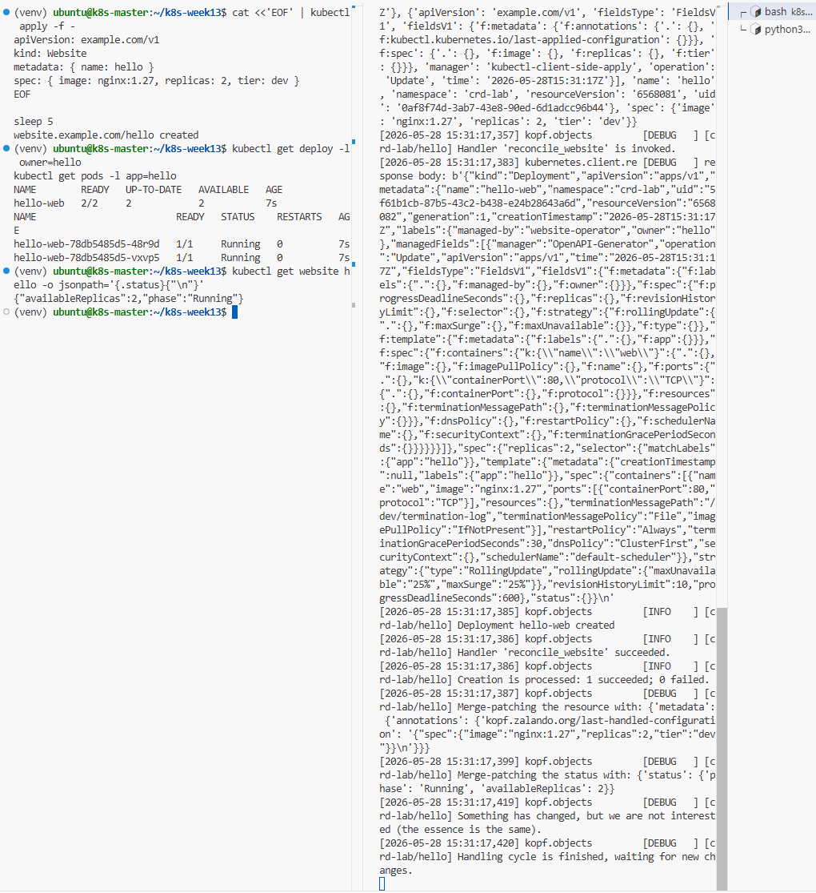

### 4. spec 변경 → Reconcile 동작 검증

```bash
# replicas 변경
kubectl patch website hello --type=merge -p '{"spec":{"replicas":4}}'
sleep 5

# Deployment 의 replicas 가 자동으로 4 로 갱신됨
kubectl get deploy hello-web
```
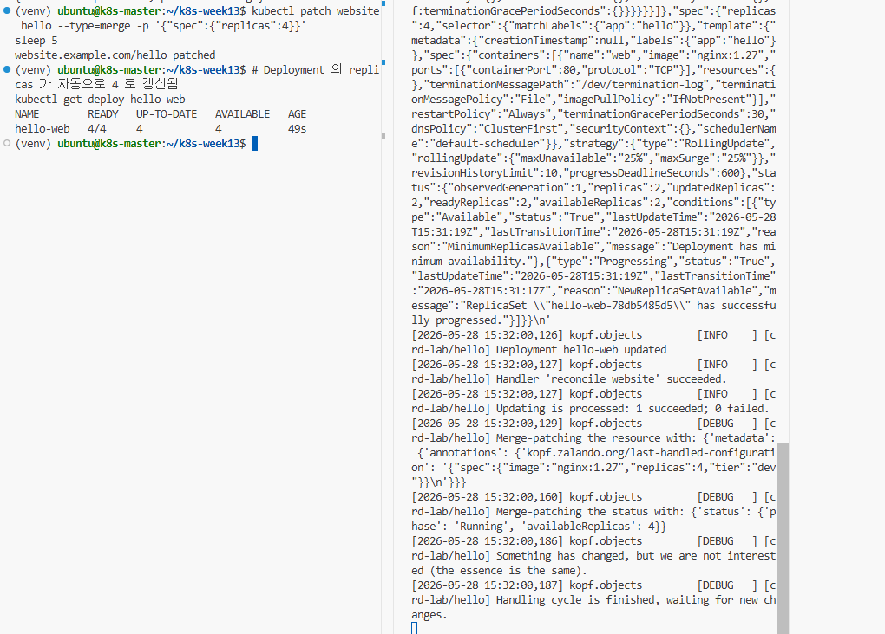

---

## Step 8. Reconcile 의 3대 원칙 검증 — Level-triggered (PDF 22쪽)

> Reconcile 의 3대 원칙(Level-triggered, 멱등성, Backoff)이 글로만 보면 추상적입니다. 실제 장애 시나리오에서 빛을 발하는 모습을 보면 훨씬 직관적이죠. 자식 Deployment 를 외부에서 강제 삭제했을 때 Controller 가 현재 상태와 spec 의 차이를 감지해 다시 만드는, 자가 치유 동작을 직접 관찰합니다.

```bash
# Deployment 강제 삭제
kubectl delete deploy hello-web

# 컨트롤러는 Website spec 의 'replicas: 4' 와 현재 상태 'Deployment 없음' 의 차이를
# 다음 Watch 이벤트 또는 Resync 주기에 감지 → 재생성해야 함
# (kopf 의 timer 데코레이터 또는 spec 변경 trigger 가 필요한 경우도 있음)
# 본 학습에선 spec 을 살짝 건드려서 reconcile 강제 실행:
kubectl annotate website hello reconcile-now="$(date +%s)" --overwrite

sleep 10
kubectl get deploy hello-web
# 다시 생성된 것을 확인
```
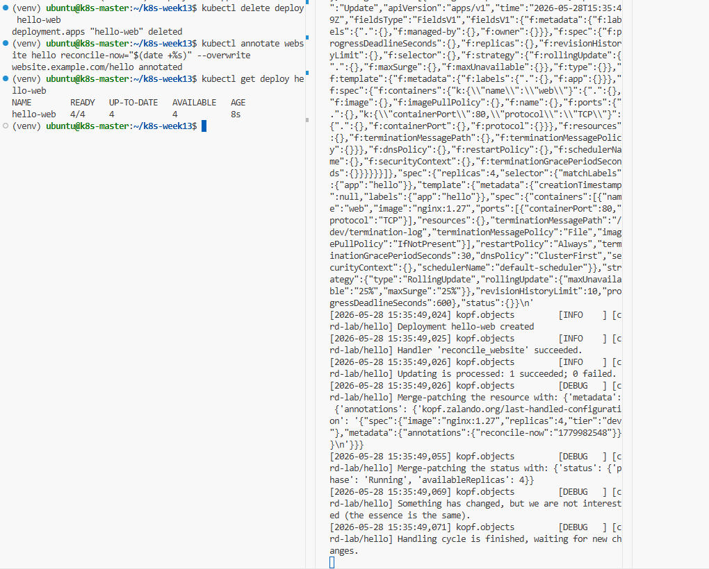

> 운영용 컨트롤러는 **Owner Reference + 자식 리소스 watch** 로 자식 변경 시 즉시 reconcile 합니다. 본 실습은 학습용 단순 버전입니다.

---

## Step 9. Built-in Admission Controller 관찰 (PDF 28쪽)

> Webhook 을 직접 만들기 전에, Kubernetes 가 이미 내장한 어드미션이 어떻게 동작하는지 체감해보는 게 좋습니다. `LimitRanger` 가 리소스 미지정 Pod 에 기본값을 자동 주입하는 모습(Mutating 성격)과 `NamespaceLifecycle` 이 Terminating 상태 네임스페이스의 신규 리소스를 차단하는 모습(Validating 성격)을 시연하면서 Step 10·11 의 흐름을 미리 그려봅니다.

### 1. LimitRanger — CPU/Memory 기본값 자동 주입

```bash
cat > limits.yaml << 'EOF'
apiVersion: v1
kind: LimitRange
metadata: { name: default-limits, namespace: crd-lab }
spec:
  limits:
    - type: Container
      default:                  # 명시 안 한 컨테이너에 자동 적용
        cpu: "200m"
        memory: "128Mi"
      defaultRequest:
        cpu: "100m"
        memory: "64Mi"
EOF

kubectl apply -f limits.yaml

# 리소스 명시 없는 Pod 생성
kubectl run noresource --image=nginx --restart=Never
sleep 3

# LimitRanger 가 자동 주입한 resources 확인
kubectl get pod noresource -o jsonpath='{.spec.containers[0].resources}{"\n"}'
# 출력: {"limits":{"cpu":"200m","memory":"128Mi"},"requests":{"cpu":"100m","memory":"64Mi"}}

kubectl delete pod noresource
```
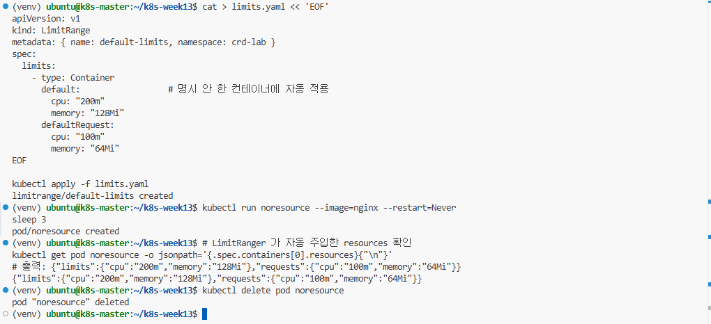

### 2. NamespaceLifecycle — Terminating NS 에 신규 리소스 차단

```bash
kubectl create namespace tmp-ns
kubectl delete namespace tmp-ns --wait=false
sleep 2
# 거의 즉시 Terminating 상태 — 신규 리소스 생성 시도하면 거부
kubectl -n tmp-ns run blocked --image=nginx 2>&1 | tail -3
# 기대: "unable to create new content in namespace tmp-ns because it is being terminated"
```
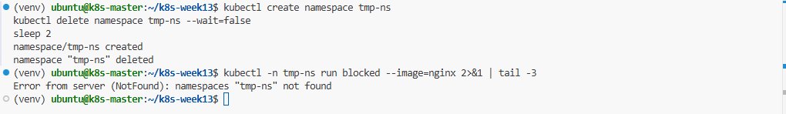

---

## Step 10. Validating Admission Webhook — kopf 로 구현 (PDF 29~31쪽)

> RBAC 만으로는 표현하기 어려운 정교한 정책(예: "이미지는 사내 레지스트리 출처만 허용") 을 강제하려면 Validating Webhook 이 필요합니다. 클러스터의 마지막 방어선이라 불리는 이유죠. kopf 가 self-signed 인증서와 ValidatingWebhookConfiguration 까지 자동 등록해주는 덕분에, 학생 환경에서도 cert-manager 없이 바로 시연할 수 있습니다.

### 1. kopf 의 admission webhook 핸들러 작성

```bash
cat > validating_webhook.py << 'EOF'
import kopf

ALLOWED_PREFIXES = ("nginx:", "docker.io/", "registry.k8s.io/")

# kopf 1.44+ 부터 admission server 명시 설정 필수
@kopf.on.startup()
def configure(settings: kopf.OperatorSettings, **_):
    # WebhookAutoServer 가 self-signed cert + master IP 자동 감지
    settings.admission.server = kopf.WebhookAutoServer(port=9443)
    # ValidatingWebhookConfiguration 자동 등록·관리
    settings.admission.managed = 'auto.kopf.dev'

# Pod 생성 시 자동 호출됨
@kopf.on.validate('pods', operations=['CREATE'], persistent=True)
def validate_image(spec, **_):
    containers = spec.get('containers', []) + spec.get('initContainers', [])
    for c in containers:
        img = c.get('image', '')
        if not any(img.startswith(p) for p in ALLOWED_PREFIXES):
            raise kopf.AdmissionError(
                f"Image '{img}' is not from an allowed registry "
                f"(allowed: {', '.join(ALLOWED_PREFIXES)})",
                code=403,
            )
EOF
```
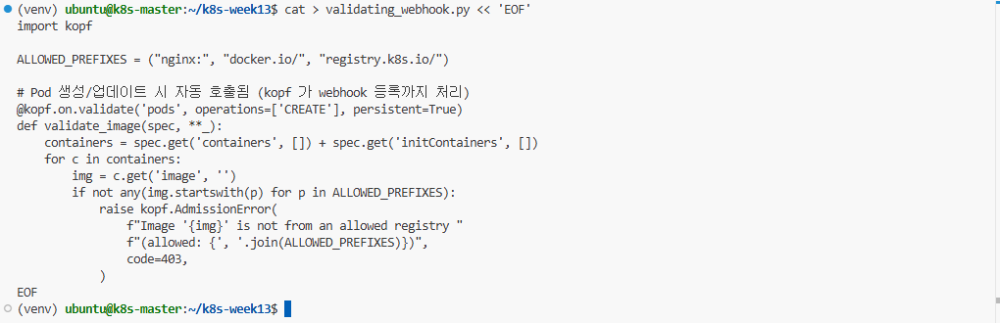

### 2. kopf 의 admission server 자동 모드로 실행

```bash
# 별도 터미널 — kopf 가 self-signed cert 생성 + ValidatingWebhookConfiguration 자동 등록
source venv/bin/activate     # 새 터미널이면 venv 활성화 필요
kopf run --namespace=crd-lab --standalone --verbose validating_webhook.py
```

> `kopf` 는 자체 인증서를 생성하고 ValidatingWebhookConfiguration 까지 자동 등록합니다. 학생 환경에서 cert-manager 없이도 즉시 동작.

### 3. 검증 — 허용 이미지 vs 차단 이미지

```bash
# 허용 (nginx:* 패턴)
kubectl run ok-nginx --image=nginx:1.27 --restart=Never
kubectl delete pod ok-nginx

# 차단 (다른 레지스트리)
kubectl run bad-image --image=quay.io/some/app:latest --restart=Never 2>&1 | tail -3
# 기대: AdmissionError "Image '...' is not from an allowed registry"
```
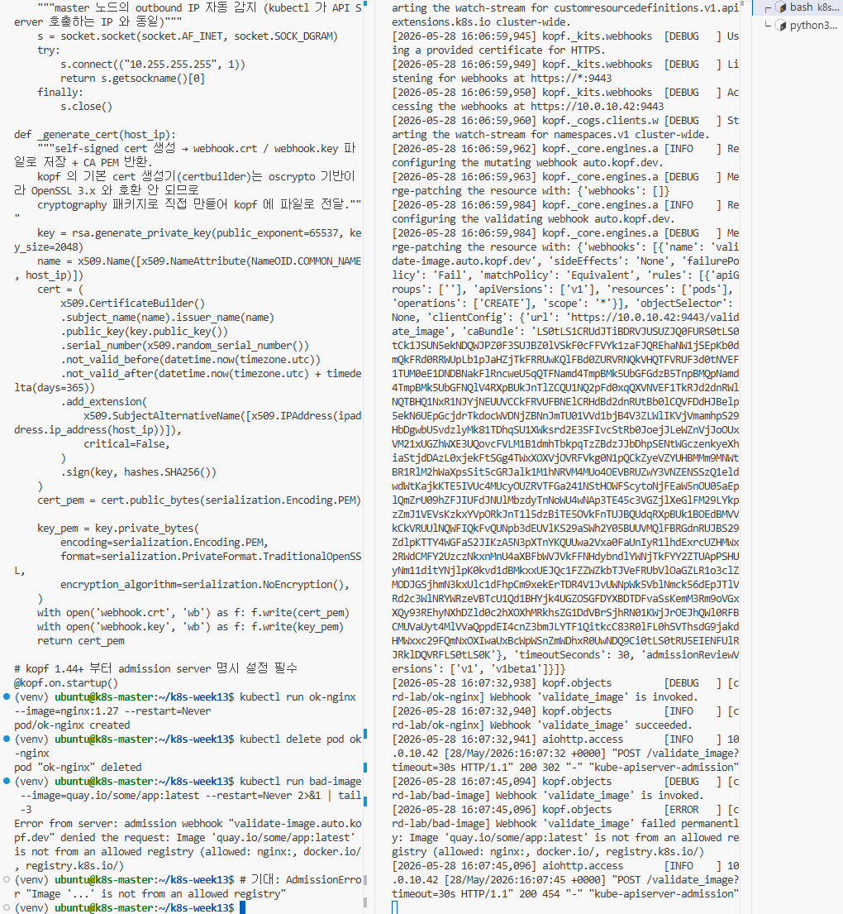

---

## Step 11. Mutating Admission Webhook — 라벨 자동 주입 (PDF 30쪽)

> 12주차에서 봤던 Istio 사이드카(Envoy) 자동 주입이 바로 이 메커니즘입니다. 요청 객체가 etcd 에 저장되기 전에 자동으로 수정되는 흐름을 라벨 자동 주입이라는 단순한 예제로 학습합니다. Mutating 이 Validating 보다 먼저 실행되는 순서도 같이 확인합니다.

```bash
cat > mutating_webhook.py << 'EOF'
import kopf

@kopf.on.mutate('pods', operations=['CREATE'], persistent=True)
def inject_label(patch, **_):
    # JSONPatch 로 라벨 추가 — Mutating 의 핵심 동작
    patch.metadata.labels['webhook-injected'] = 'true'
    patch.metadata.labels['mutated-by'] = 'kopf-demo'
EOF

# (Step 10 의 kopf 가 실행 중이라면 중단 후 다시 실행 — 두 핸들러 합쳐서)
cat > webhooks_combined.py << 'EOF'
import kopf

ALLOWED_PREFIXES = ("nginx:", "docker.io/", "registry.k8s.io/")

@kopf.on.startup()
def configure(settings: kopf.OperatorSettings, **_):
    settings.admission.server = kopf.WebhookAutoServer(port=9443)
    settings.admission.managed = 'auto.kopf.dev'

@kopf.on.mutate('pods', operations=['CREATE'], persistent=True)
def inject_label(patch, **_):
    patch.metadata.labels['webhook-injected'] = 'true'

@kopf.on.validate('pods', operations=['CREATE'], persistent=True)
def validate_image(spec, **_):
    for c in spec.get('containers', []) + spec.get('initContainers', []):
        img = c.get('image', '')
        if not any(img.startswith(p) for p in ALLOWED_PREFIXES):
            raise kopf.AdmissionError(f"Image '{img}' not allowed", code=403)
EOF

# kopf 실행
source venv/bin/activate     # 새 터미널이면 venv 활성화 필요
kopf run --namespace=crd-lab --standalone --verbose webhooks_combined.py
```

### 검증 — Pod 생성 시 라벨 자동 주입 확인

```bash
# 다른 터미널에서
kubectl run mutated --image=nginx:1.27 --restart=Never
sleep 2

kubectl get pod mutated --show-labels
# 출력 labels 에 webhook-injected=true 가 보여야 함

kubectl delete pod mutated
```
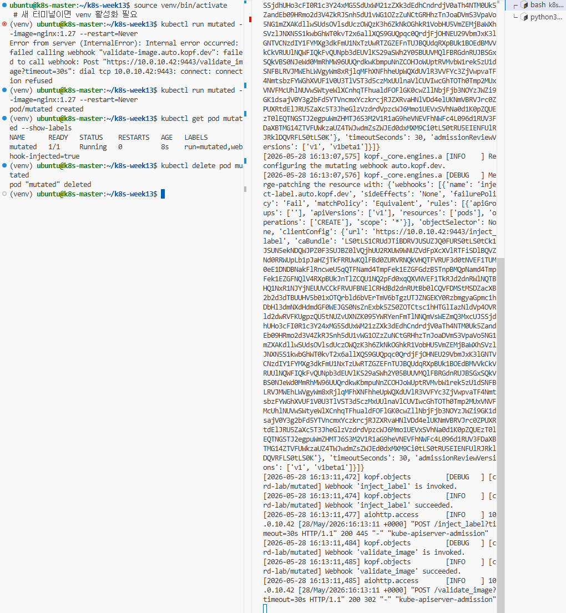

---

## Step 12. 정리

> CRD 와 WebhookConfiguration 은 클러스터 전역(Cluster-scoped) 리소스라서, 안 지우면 다음 주차나 다른 학생 환경에 영향을 줍니다. 특히 Validating Webhook 이 남아 있으면 다른 Pod 생성을 막을 수도 있어 더 주의가 필요합니다. 직접 만든 리소스와 kopf 가 자동 등록한 WebhookConfiguration 까지 안전망 옵션과 함께 일괄 정리합니다.

```bash
# Step 10~11 의 kopf webhook 종료 (Ctrl+C 후)
# WebhookConfiguration 까지 kopf 가 자동 정리하지만 안전망:
kubectl delete validatingwebhookconfiguration -l kopf.zalando.org/cluster-creation=yes --ignore-not-found
kubectl delete mutatingwebhookconfiguration   -l kopf.zalando.org/cluster-creation=yes --ignore-not-found

# Step 7 의 컨트롤러로 만든 Deployment 들 + Website 들
kubectl delete websites --all
kubectl delete deployments -l managed-by=website-operator --ignore-not-found

# CRD 자체
kubectl delete -f website-crd.yaml --ignore-not-found

# LimitRange
kubectl delete -f limits.yaml --ignore-not-found

# 임시 네임스페이스
kubectl delete namespace crd-lab --ignore-not-found

# 가상환경 비활성화
deactivate 2>/dev/null
```
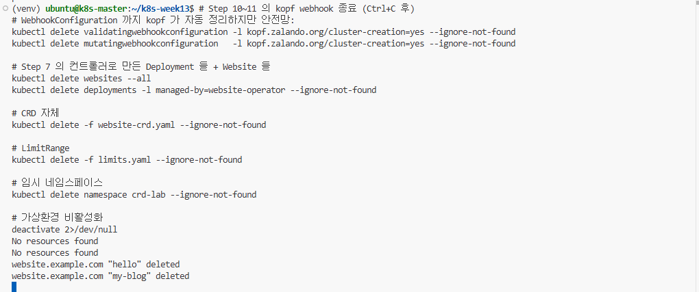

---

## 트러블슈팅 체크리스트

| 증상 | 주요 원인 / 조치 |
| :--- | :--- |
| `kubectl get crd` 에 새 CRD 가 안 보임 | `apply` 직후 1~2초 대기 필요 / `metadata.name` 이 `<plural>.<group>` 형식 위반 |
| `spec.replicas: must be less than or equal to 10` | OpenAPI v3 schema 의 `maximum` 검증 정상 동작 (의도된 결과) |
| `status` 가 patch 해도 안 채워짐 | `subresources.status: {}` 가 없거나, 일반 patch 가 status 무시 — `--subresource=status` 사용 |
| `kopf run` 이 `Unauthorized` | `~/.kube/config` 의 사용자가 CRD/리소스에 권한 없음 — `kubectl auth can-i create websites` 로 확인 |
| Webhook 이 호출 안 됨 | `kopf` 는 자동으로 etcd 등록 + cert 생성 — `kubectl get validatingwebhookconfigurations` 로 등록 여부 확인 |
| `Admission handlers exist, but no admission server/tunnel is configured` | kopf 1.44+ 부터 `@kopf.on.startup()` 에서 `settings.admission.server = kopf.WebhookAutoServer(port=9443)` + `settings.admission.managed = 'auto.kopf.dev'` 명시 필수 |
| `[Errno 98] address already in use ('0.0.0.0', 8080)` | `--liveness` 옵션의 8080 포트가 점유 중 — 옵션 빼고 실행하거나 `--liveness=http://0.0.0.0:18080/healthz` 같이 다른 포트로 |
| Webhook 거부했는데 Pod 가 생성됨 | `failurePolicy: Ignore` 또는 webhook server 다운 — `kopf run` 출력 확인 |
| `kopf: command not found` | venv 활성화 필요 — `source ~/k8s-week13/venv/bin/activate` |
| `ImportError: kubernetes` | `pip install kubernetes` 후에도 안 되면 venv 안에서 설치됐는지 확인 |
| Reconcile 이 자식 리소스 삭제 후 자동 복구 안 함 | 본 실습 컨트롤러는 단순 버전 — 운영용은 Owner Reference + 자식 watch 필요 |
| API Server 가 webhook timeout | `timeoutSeconds` 짧게 설정 / kopf 가 무거운 작업 시 별도 처리 |
| `kubectl explain website` 에 필드 설명 없음 | `openAPIV3Schema.properties.*.description` 필드 추가하면 explain 에 표시됨 |
