# 오픈소스SW(클라우드)

# 04. 도커 네트워크

> (본 실습은 Ubuntu 24.04 VM 환경을 기준으로 작성되었습니다.)

---

## Step 1. 기본 네트워크 구조 및 인터페이스 확인
도커 컨테이너가 생성되었을 때 기본적으로 할당되는 가상 인터페이스와 브리지를 확인하고 매핑 관계를 대조해 봅니다.
```bash
# 0. 실습용 백그라운드 컨테이너 실행
$ docker run -d --name test-net alpine sleep 10000
```
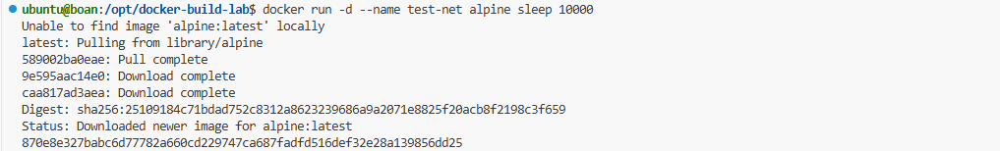

```bash
# 1. 컨테이너 내부의 eth0 인터페이스 확인
docker exec [container_name_or_id] ip addr show eth0
```
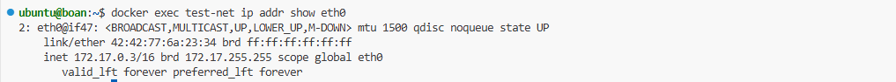

```bash
# 2. 호스트의 veth 인터페이스 목록 확인 및 브리지(docker0) 구성 상태 확인
ip link show | grep veth
sudo apt install bridge-utils
sudo brctl show docker0
```
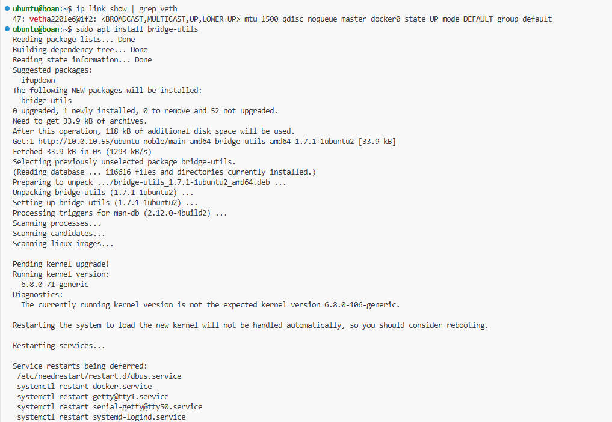

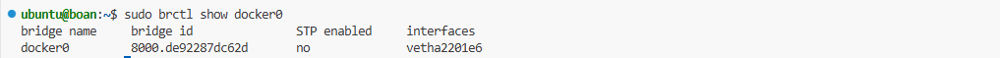

```bash
# 3. veth 페어 인덱스 대조하기 (컨테이너 eth0 호스트 veth 매칭)
# 컨테이너 내부 eth0의 iflink 인덱스 확인 (예: 47)
docker exec [container_name_or_id] cat /sys/class/net/eth0/iflink


# 호스트에서 해당 인덱스를 가진 veth 찾기
grep -l 47 /sys/class/net/veth*/ifindex
```
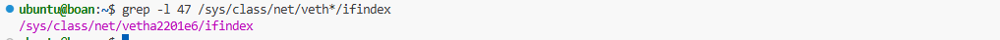

| 명령어/옵션 | 설명 |
|---|---|
| `ip addr show` | 네트워크 인터페이스와 할당된 IP 주소를 확인합니다. |
| `ip link show` | 활성화된 모든 링크 계층(가상/물리) 인터페이스 상태를 출력합니다. |
| `brctl show` | 리눅스 브리지의 구성 상태와 연결된 포트(veth) 목록을 출력합니다. |
| `docker network inspect` | 특정 도커 네트워크의 상세 정보(서브넷, IPAM, 컨테이너 등)를 조회합니다. |
---

## Step 2. 네트워크 네임스페이스 격리 원리 분석
도커가 어떻게 프로세스의 네트워크 스택을 격리하는지 리눅스 커널 관점에서 직접 확인합니다.
```bash
# 1. 테스트용 alpine 컨테이너 프로세스(PID) 조회
ps aux | grep 'sleep 10000'
```
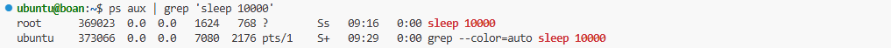

```bash
# 2. 해당 프로세스(PID)의 네임스페이스 목록 확인
# PID가 12345라고 가정
sudo ls /proc/12345/ns/
```
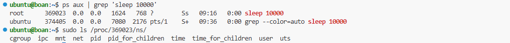

```bash
# 3. nsenter를 사용하여 네임스페이스 내부 인터페이스 직접 조회
sudo nsenter -t 12345 -n ip addr show
```
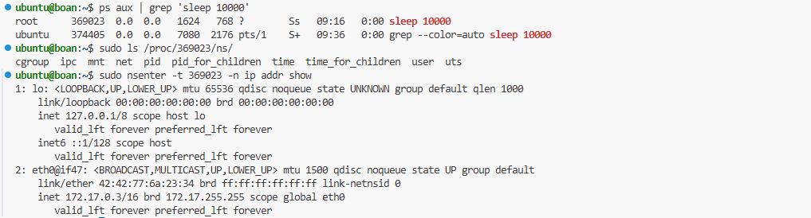

| 명령어/옵션 | 설명 |
|---|---|
| `ls /proc/[PID]/ns/` | 리눅스 커널이 해당 프로세스에 할당한 네임스페이스(net, ipc, pid 등) 파일들을 확인합니다. |
| `nsenter -t [PID] -n` | 특정 프로세스의 네트워크 격리 공간(Network Namespace) 내부로 직접 진입하여 명령을 실행합니다. |
---

## Step 3. 도커 네트워크 통신 제어 (iptables & NAT)
컨테이너 외부 통신 및 포트 포워딩을 제어하는 리눅스 커널의 방화벽/NAT 규칙을 확인합니다.
```bash
# 1. 현재 적용된 NAT 테이블 규칙 목록 확인
sudo iptables -t nat -L
```
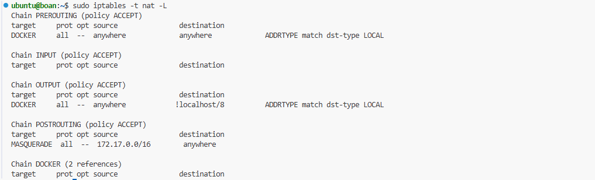

```bash
# 2. 외부 포트 8081을 내부 컨테이너 80번 포트로 전달 (DNAT 예시)
sudo iptables -t nat -A PREROUTING -p tcp --dport 8081 -j DNAT --to-destination 172.17.0.2:80
```
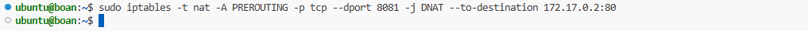

```bash
# 3. iptables의 FORWARD 체인 기본 정책 확인 및 허용(ACCEPT)으로 변경
sudo iptables -L | grep FORWARD
sudo iptables --policy FORWARD ACCEPT
```
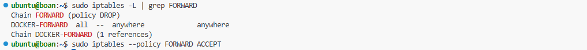

| 옵션/명령어 | 설명 |
|---|---|
| `iptables -t nat -L` | 네트워크 주소 변환(NAT)에 관련된 방화벽 룰 리스트를 출력합니다. |
| `DNAT` | Destination NAT. 외부에서 들어오는 트래픽의 목적지 IP/포트를 컨테이너로 포워딩합니다. |
| `MASQUERADE` | 동적 IP 환경에서 컨테이너의 사설 IP를 호스트의 공인 IP로 변환(SNAT)하여 외부 접속을 돕습니다. |
| `--policy FORWARD ACCEPT`| 브리지를 통과해 네임스페이스 간 전달되는 패킷의 포워딩을 전면 허용합니다. |
---

## Step 4. 유사 컨테이너 네트워크 수동 구축 (Core Lab)

리눅스 기본 명령어만 사용하여 두 개의 격리된 공간을 만들고 가상 브리지로 통신시키는 전체 
과정을 실습합니다.

---
```bash
# 1. ns1, ns2 네트워크 네임스페이스 생성 및 확인
sudo ip netns add ns1
sudo ip netns add ns2
ip netns list
```
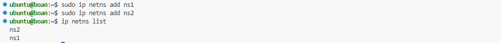

```bash
# 2. 호스트에 br0라는 가상 브리지 생성 및 활성화
sudo ip link add name br0 type bridge
sudo ip link set br0 up
```
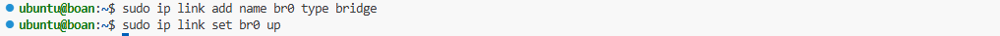

```bash
# 3. veth pair 생성 및 브리지 연결 활성화
sudo ip link add veth1 type veth peer name veth-ns1
sudo ip link add veth2 type veth peer name veth-ns2
sudo brctl addif br0 veth-ns1
sudo brctl addif br0 veth-ns2
sudo ip link set dev veth-ns1 up
sudo ip link set dev veth-ns2 up
```
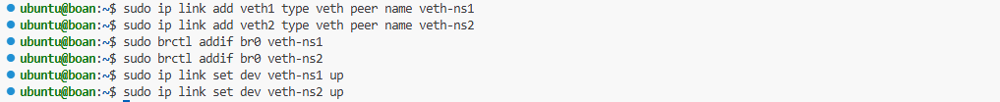

```bash
# 4. 네임스페이스 내부 IP 할당 및 인터페이스(lo 포함) 활성화
sudo ip link set veth1 netns ns1
sudo ip netns exec ns1 ip addr add 192.168.1.2/24 dev veth1
sudo ip netns exec ns1 ip link set dev veth1 up
sudo ip netns exec ns1 ip link set lo up

sudo ip link set veth2 netns ns2
sudo ip netns exec ns2 ip addr add 192.168.1.3/24 dev veth2
sudo ip netns exec ns2 ip link set dev veth2 up
sudo ip netns exec ns2 ip link set lo up
```
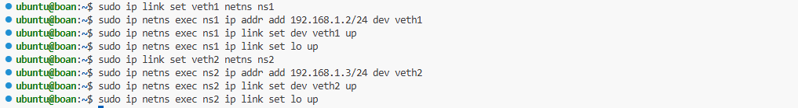

```bash
# 5. 격리된 네임스페이스 간 상호 통신(Ping) 테스트
sudo ip netns exec ns1 ping -c 1 192.168.1.3
sudo ip netns exec ns2 ping -c 1 192.168.1.2
```
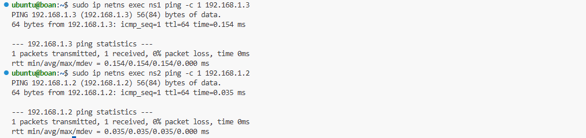

---
## Step 5. 포트 퍼블리싱 실습 (EXPOSE vs PUBLISH)
격리된 컨테이너의 포트를 외부로 개방(바인딩)하는 방법입니다.

---
```bash
# 1. [Host] 호스트 네트워크 스택 직접 공유 (격리 해제)
docker run -d --net host --name my-ubuntu ubuntu tail -f /dev/null
```
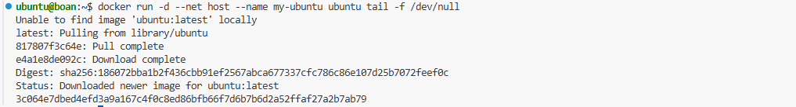

```bash
# 2. [None] 완벽한 네트워크 격리 (Loopback만 존재)
docker run --rm -d --net none --name no-net-nginx nginx
```


```bash
# 3. [Overlay] 다중 호스트 환경의 분산 네트워크 생성 (Swarm 매니저 기준)
docker swarm init
docker network create -d overlay my-overlay
docker service create --name my-web --replicas 3 --network my-overlay -p 80:80 nginx
```
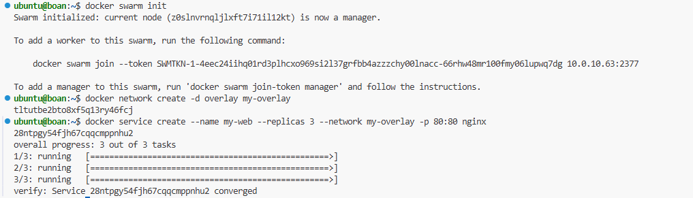

```bash
# 4. [Ipvlan/Macvlan] 물리적 네트워크 인터페이스 기반 통신 생성
docker network create -d macvlan \
  --subnet=192.168.10.0/24 \
  --gateway=192.168.10.1 \
  -o parent=ens3 \
  macvlan-net

docker run -it --rm --network macvlan-net alpine ip addr show eth0
```
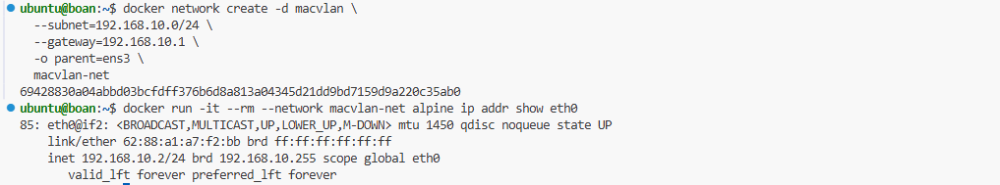

---

# 05. 도커 볼륨과 로그 관리

> (본 실습은 Ubuntu 24.04 VM 환경을 기준으로 작성되었습니다.)

---

## Step 1. 도커 볼륨 생성 및 유형별 마운트
컨테이너의 생명주기(Lifecycle)와 무관하게 데이터를 안전하게 보존하기 위한 볼륨(Volume)을 생성하고 확인합니다.

```bash
# 1. 'db'라는 이름의 Named Volume 생성
docker volume create --name db
```
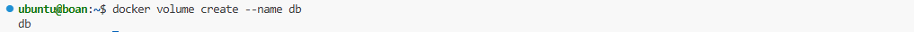

```bash

# 2. 생성된 볼륨 상세 정보 조회 (호스트의 실제 저장 경로 확인)
# 기본 저장 경로는 /var/lib/docker/volumes/ 입니다.
docker volume inspect db
```
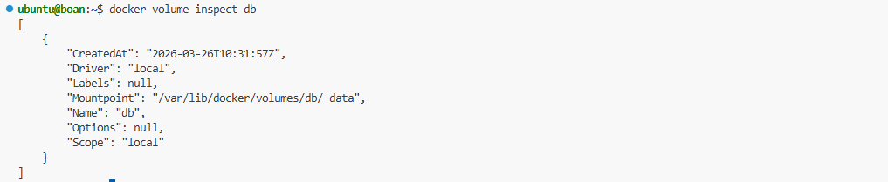

```bash
# 3. Anonymous Volume 생성 (이름 없이 경로만 지정)
docker run -d --name nginx-anon -v /usr/share/nginx/html nginx
```
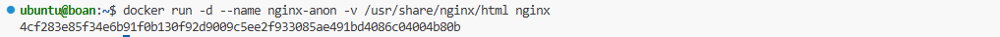

```bash
# 4. 전체 볼륨 목록 확인 (Named와 Anonymous 볼륨 비교)
# Anonymous 볼륨은 64자 길이의 해시값으로 표시됩니다.
docker volume ls
```
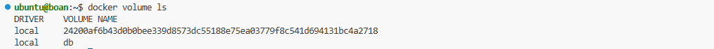

| 명령어 | 설명 |
|:---|:---|
| `docker volume create` | 명시적인 이름으로 새로운 볼륨을 생성하여 관리 용이성을 확보합니다. |
| `docker volume ls` | 호스트 내 생성된 모든 도커 볼륨 목록을 조회하여 확인합니다. |
| `docker volume inspect` | 볼륨의 호스트 마운트 경로 등 상세 정보를 확인합니다. |
---
## Step 2. Host Volume 및 읽기 전용(:ro) 마운트
호스트 운영체제의 특정 디렉토리를 직접 연결(Bind Mount)하고, 보안을 위해 읽기 전용으로 설정하는 방법을 실습합니다.

---
```bash
# 1. 호스트에 테스트용 디렉토리 및 인덱스 파일 생성
sudo mkdir -p /opt/html_files
echo "Hello, World!" | sudo tee /opt/html_files/index.html
```
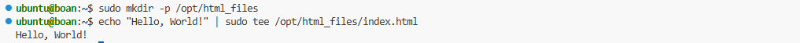

```bash
# 2. 호스트 디렉토리를 컨테이너에 마운트하여 Nginx 실행 (-v 호스트경로:컨테이너경로)
docker run -d --name nginx-host-vol -v /opt/html_files:/usr/share/nginx/html -p 8082:80 nginx
curl localhost:8082

```
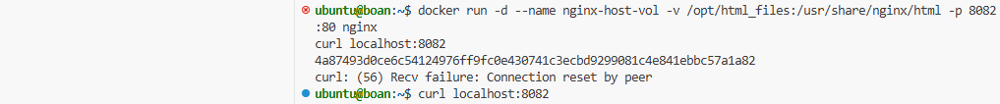

```bash
# 3. 데이터 변조 방지를 위한 읽기 전용(:ro) 마운트 실행
docker volume create web-volume
docker run -d --name nginx-ro -v web-volume:/usr/share/nginx/html:ro nginx
```
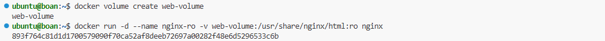

```bash
# 4. 쓰기 작업 시도 및 실패 확인 (Read-only file system 에러 발생)
docker exec nginx-ro touch /usr/share/nginx/html/test.txt
```
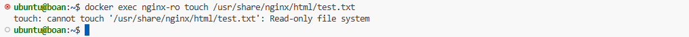

## Step 3. 볼륨 컨테이너 공유 (--volumes-from)
특정 컨테이너를 데이터 저장소 전용으로 지정하고, 다른 컨테이너들이 이 마운트 설정을 상속받아 데이터를 공유하는 패턴입니다.

---
```bash
# 1. 데이터를 저장할 전용 컨테이너(my-volume) 생성
docker run -d -it --name my-volume -v /opt/html_files:/usr/share/nginx/html ubuntu:focal
```
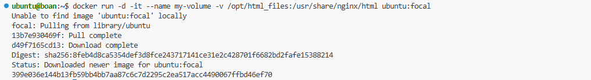

```bash
# 2. --volumes-from 옵션으로 마운트 정보 상속받아 Nginx 실행
docker run -d --name nginx-shared --volumes-from my-volume nginx
```
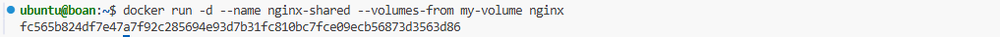

## Step 4. 상태 유지형(Stateful) 애플리케이션: MySQL 데이터 영속성 검증
컨테이너가 삭제되어도 데이터베이스 내부의 정보가 안전하게 유지되는지 확인합니다.

---

```bash
# 1. 전용 볼륨 생성 및 MySQL 컨테이너 실행
docker volume create db-volume
docker run --name my-mysql -d -e MYSQL_ROOT_PASSWORD=password -v db-volume:/var/lib/mysql -p 3306:3306 mysql:5.7
```
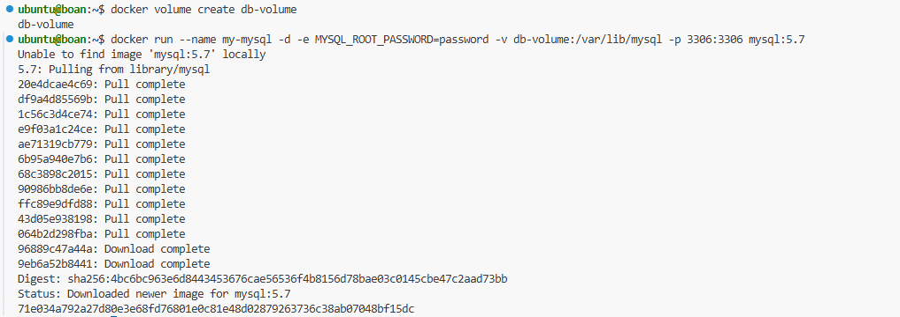

```bash
# 2. 컨테이너 내부 쉘로 접속하여 테스트 DB 생성 (Interactive Mode)
docker exec -it my-mysql mysql -u root -p
# 비밀번호 입력 후 MySQL 프롬프트에서:
mysql> CREATE DATABASE mydb;
mysql> SHOW DATABASES;
mysql> exit
```
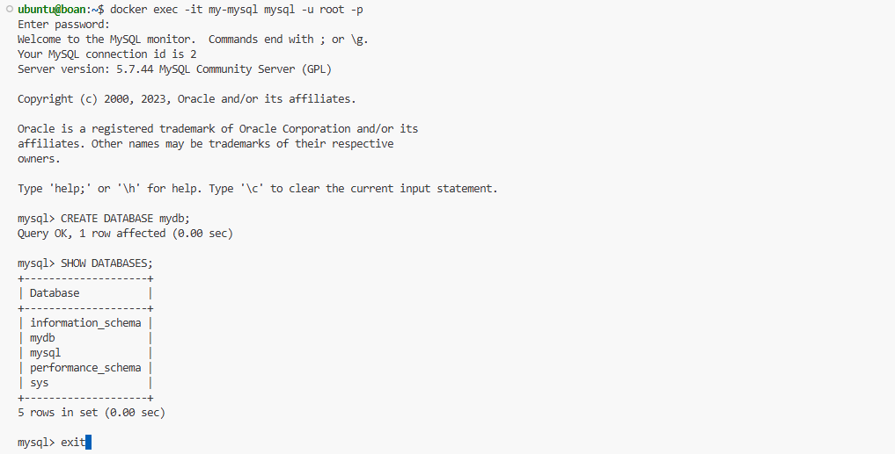

```bash
# 3. 컨테이너 강제 종료 및 재시작
docker stop my-mysql
docker start my-mysql
```
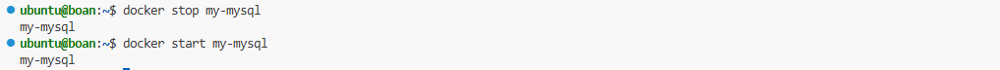

```bash
# 4. 재접속하여 DB 유지 여부 검증
docker exec -it my-mysql mysql -u root -p
# 로그인 후:
mysql> SHOW DATABASES;
# 기존에 생성한 'mydb'가 그대로 유지되고 있는지 확인합니다.
```
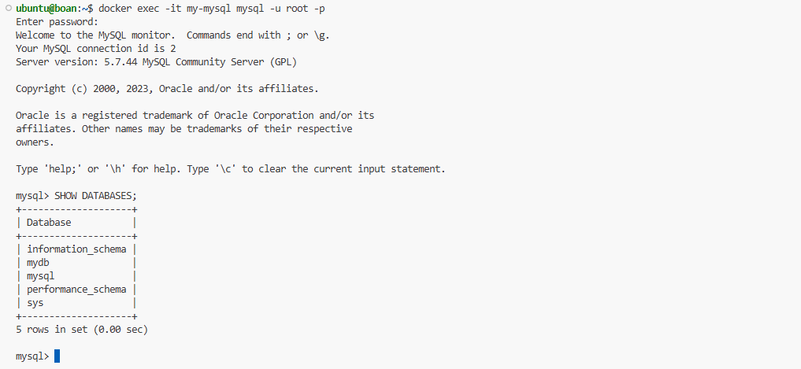

## Step 5. [보안 심화] LUKS 기반 도커 볼륨 암호화
리눅스 표준 디스크 암호화(LUKS)를 활용하여 호스트 수준에서 데이터를 암호화하고 도커에 마운트합니다.

```bash
# 1. 1GB 더미 파일 생성 및 루프백 디바이스 연결
sudo dd if=/dev/zero of=secret_vol bs=1M count=1024
sudo ln -s $(sudo losetup -f --show secret_vol) /dev/loop_boan
```
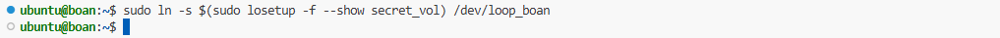

```bash
# 2. LUKS 포맷(초기화) 및 암호화된 볼륨 매핑 열기
# 포맷 확인 시 반드시 대문자 YES 입력 후, 사용할 패스워드를 지정합니다.
sudo cryptsetup luksFormat /dev/loop_boan
sudo cryptsetup luksOpen /dev/loop_boan encrypted_vol
```
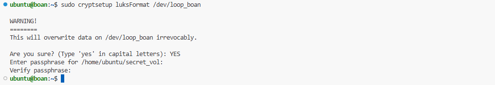
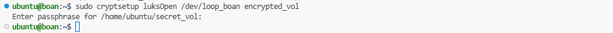

```bash
# 3. 매핑된 장치에 파일시스템(ext4) 생성 및 디렉토리 마운트
sudo mkfs.ext4 /dev/mapper/encrypted_vol
sudo mkdir -p /mnt/secure_data
sudo mount /dev/mapper/encrypted_vol /mnt/secure_data
```
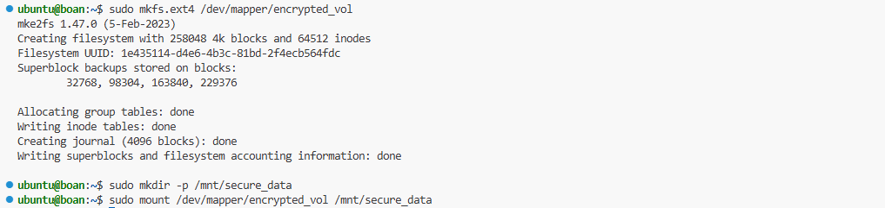

```bash
# 4. 암호화된 보안 디렉토리를 컨테이너 볼륨으로 연결하여 실행
docker run -d --name secure-db -v /mnt/secure_data:/var/lib/mysql mysql:5.7
```
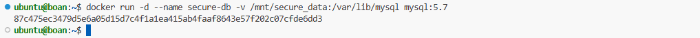

```bash
# 5. [실습 종료 후 정리] 마운트 및 암호화 채널 안전하게 해제
docker rm -f secure-db
sudo umount /mnt/secure_data
sudo cryptsetup luksClose encrypted_vol
sudo losetup -d /dev/loop_boan
sudo rm /dev/loop_boan
```
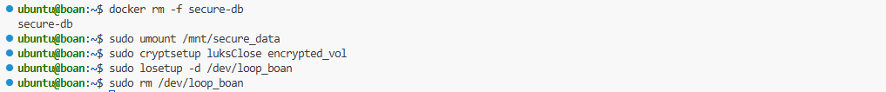

## Step 6. 컨테이너 로그 관리 및 용량 제한 (Log Rotation)
표준 입출력(STDOUT/STDERR)으로 발생하는 로그를 확인하고, 디스크 고갈을 막기 위한 로테이션 정책을 적용합니다.

---

```bash
# 1. 실시간 로그 스트림 확인 및 타임스탬프 표시
docker logs -f my-mysql
docker logs --tail 10 -t my-mysql
```
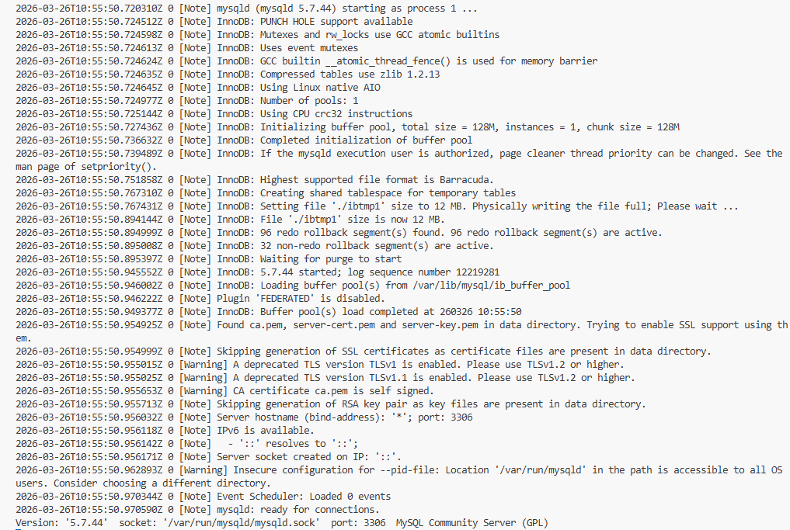
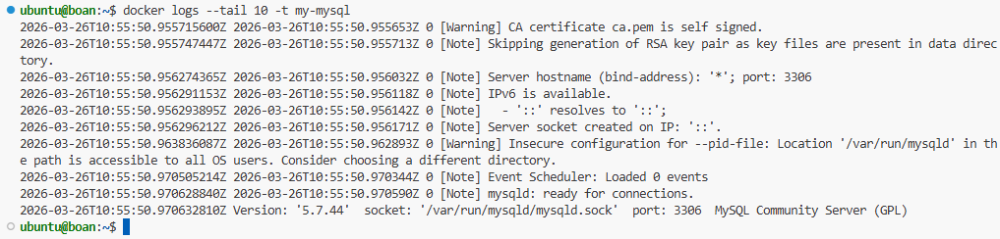

```bash
# 2. 디스크 용량 관리를 위한 로그 로테이션 옵션 적용하여 컨테이너 실행
# 파일당 최대 3MB, 보관 파일 최대 5개로 제한합니다.
docker run -d \
  --log-driver=json-file \
  --log-opt max-size=3m \
  --log-opt max-file=5 \
  nginx
```
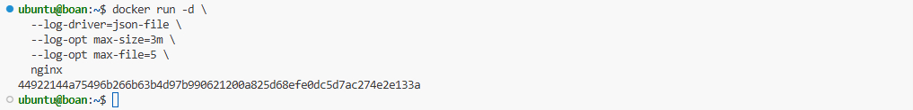

| 명령어/옵션 | 설명 |
|:---|:---|
| `docker logs -f` | 생성되는 로그를 실시간으로 계속 출력(Follow)합니다. |
| `docker logs --tail n` | 마지막 n줄의 로그만 확인하여 스크롤 낭비를 방지합니다. |
| `--log-opt max-size` | 단일 로그 파일의 최대 허용 크기를 설정합니다 (예: 10m, 1g). |
| `--log-opt max-file` | 보관할 최대 로그 파일 개수를 설정하여 로테이션을 적용합니다. |


## 🏆 [종합 심화 과제] BoanLab 안전한 2-Tier 웹 서비스 아키텍처 구축 작전!

**📝 시나리오 배경**
네트워크 시스템 및 보안 연구실(BoanLab)에서 새로운 사내 웹 서비스를 런칭하려고 합니다. 이 서비스는 외부의 해킹 위협과 서버 디스크 고갈 문제로부터 안전해야 합니다. 
보안 책임자인 당신은 도커의 **네트워크 격리, 볼륨 마운트, 읽기 전용 권한, 로그 로테이션** 기술을 총동원하여 가장 안전한 Web-DB 아키텍처를 구축해야 합니다.

### 🎯 미션 요구 사항 (Tasks)

**🔥 Task 1. 인프라 준비 (네트워크 및 스토리지)**
1. Web과 DB 컨테이너가 우리끼리만 통신할 수 있도록 `boan-net`이라는 이름의 사용자 정의 브리지(Bridge) 네트워크를 생성하세요.
2. DB 데이터가 날아가지 않도록 `boan-db-data`라는 이름의 볼륨(Named Volume)을 생성하세요.
3. 호스트 운영체제의 `/opt/boan_web` 디렉토리를 만들고, 그 안에 `index.html` 파일을 생성하여 "Welcome to BoanLab Secure Web!" 이라는 내용을 작성하세요.

**👨‍💻 Task 2. 철통 보안 DB 컨테이너 실행**
1. `mysql:5.7` 이미지를 사용하여 `boan-db`라는 이름의 컨테이너를 실행하세요. (루트 비밀번호 설정 필수)
2. 이 컨테이너는 반드시 외부 접근을 차단해야 하므로 **포트 포워딩(`-p`) 옵션을 절대 사용하지 마세요.**
3. 앞서 만든 `boan-net` 네트워크에 연결(`--net`)하세요.
4. 앞서 만든 `boan-db-data` 볼륨을 MySQL의 기본 데이터 경로(`/var/lib/mysql`)에 마운트(`-v`)하세요.

**🚀 Task 3. 철벽 방어 Web 컨테이너 실행**
1. `nginx` 이미지를 사용하여 `boan-web`이라는 이름의 컨테이너를 실행하세요.
2. DB와 통신할 수 있도록 `boan-net` 네트워크에 연결하세요.
3. 외부에서 웹 접속이 가능하도록 호스트의 `8080` 포트를 컨테이너의 `80` 포트로 연결(`-p`)하세요.
4. 호스트의 `/opt/boan_web` 디렉토리를 Nginx의 기본 웹 경로(`/usr/share/nginx/html`)에 마운트하되, 해커가 웹 페이지를 위변조(Defacement)하지 못하도록 반드시 **읽기 전용(`:ro`)**으로 설정하세요.
5. 악의적인 트래픽 폭주로 서버 디스크가 가득 차는 것을 막기 위해, 로그 드라이버 옵션(`--log-opt`)을 적용하여 파일당 **최대 3MB, 최대 3개**까지만 로그가 보관되도록 설정하세요.

**💣 Task 4. 최종 아키텍처 검증 (최종 보고)**
모든 컨테이너가 띄워졌다면 아래 3가지 검증을 수행하세요.
1. **[네트워크 격리 검증]** 호스트에서 `curl localhost:8080`으로 웹페이지가 잘 뜨는지 확인하고, 호스트 장비에서 DB 포트(3306)로는 아예 접근이 불가능한지 확인하세요.
2. **[읽기 전용 검증]** `docker exec` 명령어로 `boan-web` 컨테이너 내부에 접속하여 `touch /usr/share/nginx/html/hacked.txt` 명령어를 실행해 보세요. `Read-only file system` 에러가 나면서 해킹 방어에 성공해야 합니다.
3. **[로그 제한 검증]** `docker inspect` 명령어를 사용하여 `boan-web` 컨테이너의 LogConfig가 지시한 대로(max-size: 3m, max-file: 3) 잘 적용되었는지 출력 결과를 확인하세요.